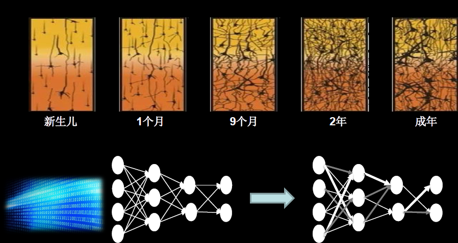
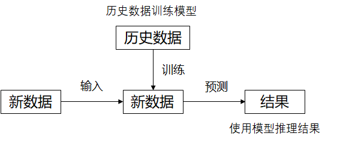
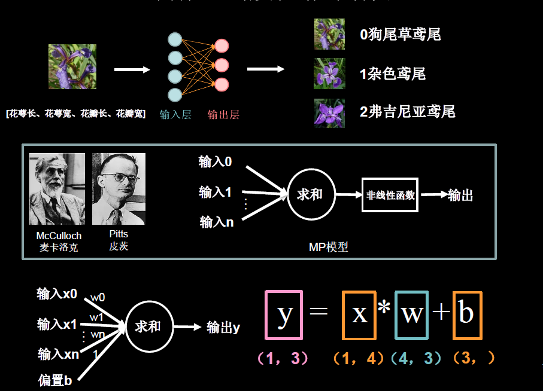
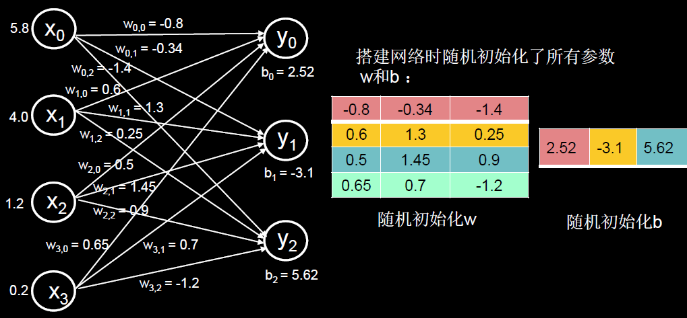
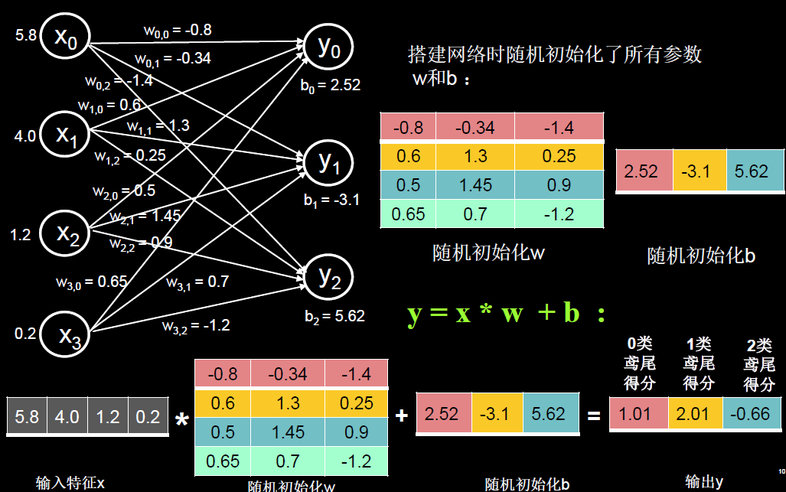
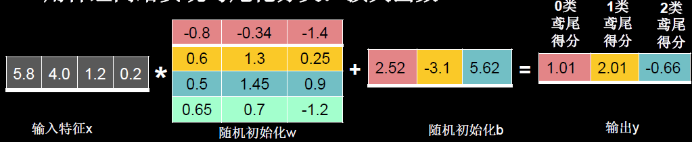
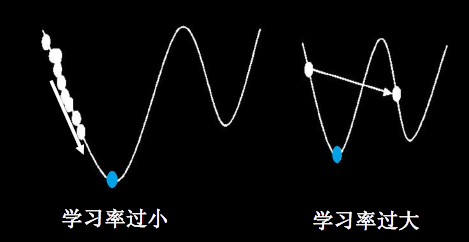
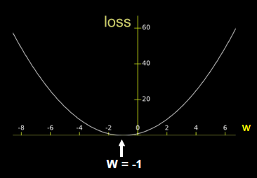
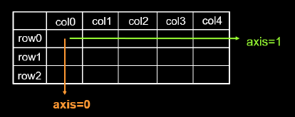
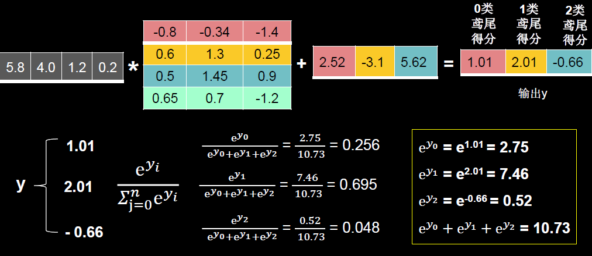

---
jupyter:
  jupytext:
    text_representation:
      extension: .md
      format_name: markdown
      format_version: '1.2'
      jupytext_version: 1.6.0
  kernelspec:
    display_name: Python 3
    language: python
    name: python3
---

# 一、初识TensorFlow

## 1.1人工智能三学派

本讲目标:学会神经网络计算过程，使用基于TF2原生代码搭建你的第一个的神经网络训练模型

当今人工智能主流方向——连接 主义

- 前向传播
- 损失函数(初体会)
- 梯度下降(初体会)
- 学习率(初体会)
- 反向传播更新参数

人工智能：让机器具备人的思维和意识。

人工智能三学派:

- 行为主义:基于控制论，构建感知-动作控制系统。 (控制论，如平衡、行走、避障等自适应控制系统)
- 符号主义:基于算数逻辑表达式，求解问题时先把问题描述为表达式，再求解表达式。(可用公 式描述、实现理性思维，如专家系统)
- 连接主义:仿生学，模仿神经元连接关系。(仿脑神经元连接，实现感性思维，如神经网络)

理解:基于连结主义的神经网络设计过程



用计算机仿出神经网络连接关系，让计算机具备感性思维。

- 准备数据:采集大量”特征标签”数据
- 搭建网络:搭建神经网络结构
- 优化参数:训练网络获取最佳参数(反传)
- 应用网络:将网络保存为模型，输入新数据，输出分类或预测结果(前传)



## 1.2神经网络设计过程

给鸢尾花分类(lris)

- 0狗尾草鸢尾
- 1杂色鸢尾
- 2弗吉尼亚鸢尾

人们通过经验总结出了规律:通过测量花的花曹长、花尊宽、花瓣长、花瓣宽，可以得出鸢尾花的类别。

(如:花萼长>花尊宽且花瓣长花瓣宽>2则为1杂色鸢尾)

if语句case语句——专家系统，把专家的经验告知计算机，计算机执行逻辑判别(理性计算)，给出分类。

**神经网络**：采集大量(输入特征：花萼长、花夢宽、花瓣长、花瓣宽，标签(需人工 标定)：对应的类别)数据对构成数据集。

把数据集限入搭建好的神经网络结构，网络优化参 数得到模型，模型读入新输入特征，输出识别‘

### 用神经网络实现鸢尾花分类



#### 喂入数据



#### 前向传播



代码示例：

```python
import tensorflow as tf

x1 = tf.constant([[5.8, 4.0, 1.2, 0.2]])  # 5.8,4.0,1.2,0.2（0）
w1 = tf.constant([[-0.8, -0.34, -1.4],
                  [0.6, 1.3, 0.25],
                  [0.5, 1.45, 0.9],
                  [0.65, 0.7, -1.2]])
b1 = tf.constant([2.52, -3.1, 5.62])
y = tf.matmul(x1, w1) + b1
print("x1.shape:", x1.shape)
print("w1.shape:", w1.shape)
print("b1.shape:", b1.shape)
print("y.shape:", y.shape)
print("y:", y)

#####以下代码可将输出结果y转化为概率值#####
y_dim = tf.squeeze(y)  # 去掉y中纬度1（观察y_dim与 y 效果对比）
y_pro = tf.nn.softmax(y_dim)  # 使y_dim符合概率分布，输出为概率值了
print("y_dim:", y_dim)
print("y_pro:", y_pro)

#请观察打印出的shape
```

#### 损失函数



得出结果为1分类

损失函数(loss function) ：预测值(y)与标准答案(y_ )的差距。

损失函数可以定量判断W、b的优劣，当损失函数输出最小时，参数w、b会出现最优值。

均方误差：
$$
\operatorname{MSE}\left(y, y_{-}\right)=\frac{\sum_{k=0}^{n}(y-y)^{2}}{n}
$$

#### 梯度下降

目的：想找到一组参数w和b,使得损失函数最小。

梯度：函数对各参数求偏导后的向量。函数梯度下降方向是函数减小方向。

梯度下降法：沿损失函数梯度下降的方向，寻找损失函数的最小值，得到最优参数的方法。
$$
\begin{array}{l}
w_{t+1}=w_{t}-l r * \frac{\partial l o s s}{\partial w_{t}} \\
b_{t+1}=b-l r * \frac{\partial l o s s}{\partial b_{t}} \\
w_{t+1} * x+b_{t+1} \rightarrow y
\end{array}
$$
学习率(learning rate, Ir) ：当学习率设置的过小时，收敛过程将变得十分缓慢。而当学习率设置的过大时，梯度可能会在最小值附近来回震荡，甚至可能无法收敛。



#### 反向传播

反向传播：从后向前，逐层求损失函数对每层神经元参数的偏导数，迭代更新所有参数。
$$
w_{t+1}=w_{t}-l r * \frac{\partial l o s s}{\partial w_{t}}
$$
例如损失函数为：
$$
\operatorname{loss}=(w+1)^{2}
$$
求偏导
$$
\frac{\partial \operatorname{loss}}{\partial w}=2 w+2
$$
参数w初始化为5，学习率为0.2则

| 次数 | 参数w | 结果                          |
| ---- | ----- | ----------------------------- |
| 1    | 5     | `5-0.2*（2*4+2）=2.6`         |
| 2    | 2.6   | `2.6-0.2*（2*2.6+2）=1.16`    |
| 3    | 1.16  | `1.16-0.2*（2*1.16+2）=0.296` |
| 4    | 0.296 | .......                       |



求出w的最佳值，使得损失函数最小，代码示例：

```python
import os
os.environ['TF_CPP_MIN_LOG_LEVEL'] = '2'  # 关闭log信息

import tensorflow as tf

w = tf.Variable(tf.constant(5, dtype=tf.float32))
# print(w)
lr = 0.2
epoch = 20

for i in range(epoch):  # for epoch 定义顶层循环，表示对数据集循环epoch次，此例数据集数据仅有1个w,初始化时候constant赋值为5，循环40次迭代。
    # 用with结构让损失函数loss对参数w求梯度
    with tf.GradientTape() as tape:  # with结构到grads框起了梯度的计算过程。
        loss = tf.square(w + 1)
    grads = tape.gradient(loss, w)  # .gradient函数告知谁对谁求导,此处为loss函数对w求偏导

    w.assign_sub(lr * grads)  # .assign_sub 对变量做自减 即：w -= lr*grads 即 w = w - lr*grads
    print("After %s epoch,w is %f,loss is %f" % (i, w.numpy(), loss))

# lr初始值：0.2   请自改学习率  0.001  0.999 看收敛过程
# 最终目的：找到 loss 最小 即 w = -1 的最优参数w
```

## 1.3张量生成

张量(Tensor) ：多维数组(列表)

阶：张量的维数

| 维数 | 阶   | 名字        | 例子                              |
| ---- | ---- | ----------- | --------------------------------- |
| 0-D  | 0    | 标量 scalar | s=1 2 3                           |
| 1-D  | 1    | 向量 vector | v=[1, 2, 3]                       |
| 2-D  | 2    | 矩阵 matrix | m=`[[1,2,3],[4,5,6][7,8,9]]`      |
| N-D  | N    | 张量 tensor | t=[[[    有几个中括号就是几阶张量 |

张量可以表示0阶到n阶数组(列表)

### 数据类型

- `tf.int`, `tf.float`
  - `tf.int 32`，`tf.float 32`, `tf.float 64`
- `tf.bool`
  - `tf.constant([True, False])`
- `tf.string`
  - `tf.constant("Hello, world!")`

### 如何创建一个Tensor

**创建一个张量**

```
tf.constant(张量内容, dtype=数据类型（可选）)
```

代码示例

```python
import os
os.environ['TF_CPP_MIN_LOG_LEVEL'] = '2'  # 关闭log信息

import tensorflow as tf

a = tf.constant([1, 5], dtype=tf.int64)
b = tf.constant(1)
c = tf.constant([[1,2],[2,3]])
d = tf.constant([[[1,2],[2,3]],[[1,2],[2,3]]])
print("b",b)
print("a:", a)
print("c:", c)
print("d:", d) # 张量的维度和shape中的“,”分隔开的数字有关，未分开，就是0维，分开一个就是1维，分开两个就是2维，
print("a.dtype:", a.dtype)
print("a.shape:", a.shape)

# 本机默认 tf.int32  可去掉dtype试一下 查看默认值
```

将numpy的数据类型转换为Tensor数据类型tf. convert to_tensor(数据名，dtype=数 据类型(可选))

代码示例

```python
import tensorflow as tf
import numpy as np

a = np.arange(0, 5)
b = tf.convert_to_tensor(a, dtype=tf.int64)
print("a:", a)
print("b:", b)
```

- **创建全为0的张量**
  - `tf. zeros(维度)`
- **创建全为1的张量**
  - `tf. ones(维度)`
- **创建全为指定值的张量**
  - `tf. fil(维度，指定值)`

维度：

- 一维直接写个数
- 二维用[行，列]
- 多维用[n,m,.K....]

代码示例：

```python
import tensorflow as tf

a = tf.zeros([2, 3])
b = tf.ones(4)
c = tf.fill([2, 2], 9)
print("a:", a)
print("b:", b)
print("c:", c)
```

- **生成正态分布的随机数，默认均值为0，标准差为1**
  - `tf. random.normal (维度，mean=均值，stddev=标准差)`
- **生成截断式正态分布的随机数**
  - `tf. random.truncated normal (维度，mean=均值，stddev=标准差)`

在`tf.truncated normal`中如果随机生成数据的取值在(μ-2σ， μ+2σ) 之外,则重新进行生成，保证了生成值在均值附近。(μ:均值，σ:标准差）

标准差计算公式：
$$
\sigma=\sqrt{\frac{\sum_{i=1}^{n}\left(x_{i}-\bar{x}\right)^{2}}{n}}
$$
代码示例：

```python
import tensorflow as tf

d = tf.random.normal([2, 2], mean=0.5, stddev=1)
print("d:", d)
e = tf.random.truncated_normal([2, 2], mean=0.5, stddev=1)
print("e:", e)
```

生成均匀分布随机数( minval, maxval ) tf. random. uniform(维度，minval=最小值，maxval=最大值)

代码示例

```python
import tensorflow as tf

f = tf.random.uniform([2, 2], minval=0, maxval=1,seed=11)
print("f:", f)
```

## 1.4 TF2常用函数

- 强制tensor转换为该数据类型
  - `tf.cast (张量名，dtype=数据类型)`
- 计算张量维度上元素的最小值
  - `tf.reduce_ min (张量名)`
- 计算张量维度上元素的最大值
  - `tf.reduce_ max(张量名)`
- 将tensor转换为numpy
  - `tensor.numpy()`

代码示例：

```python
import tensorflow as tf

x1 = tf.constant([1., 2., 3.], dtype=tf.float64)
print("x1:", x1)
x2 = tf.cast(x1, tf.int32)
print("x2:", x2)
print("minimum of x2：", tf.reduce_min(x2))
print("maxmum of x2:", tf.reduce_max(x2))

a = tf.constant(5, dtype=tf.int64)
print("tensor a:", a)
print("numpy a:", a.numpy())
```

### 理解axis

在一个二维张量或数组中，可以通过调整axis等于0或1控制执行维度。

axis=0代表跨行(经度，down),而axis=1代表跨列(纬度，across)

如果不指定axis,则所有元素参与计算。



- 计算张量沿着指定维度的平均值
  - `tf.reduce_mean (张量名，axis=操作轴)`
- 计算张量沿着指定维度的和
  - `tf.reduce_sum (张量名，axis=操作轴)`

代码示例

```python
x = tf.constant([[1, 2, 3], [2, 2, 3]])
print("x:", x)
print("mean of x:", tf.reduce_mean(x))  # 求x中所有数的均值
print("sum of x:", tf.reduce_sum(x, axis=1))  # 求每一行的和
```

### 变量`tf.Variable`

`tf.Variable ()` 将变量标记为“可训练”，被标记的变量会在反向传播中记录梯度信息。神经网络训练中，常用该函数标记待训练参数。

`tf.Variable(初始值)`

定义变量

```python
w = tf.Variable(tf.random.normal([2, 2], mean=0, stddev=1))
print(w)
tf.print(w)
```

### TensorFlow中的数学运算

- 对应元素的四则运算: `tf.add`, `tf.subtract`, `tf.multiply`, `tf.divide`
- 平方、次方与开方: `tf.square`, `tf.pow`, `tf.sqrt`
- 矩阵乘: `tf.matmul`

**对应元素的四则运算**

- 实现两个张量的对应元素相加
  - `tf.add (张量1，张量2)`
- 实现两个张量的对应元素相减
  - `tf.subtract (张量1，张量2)`
- 实现两个张量的对应元素相乘
  - `tf.multiply (张量1,张量2)`
- 实现两个张量的对应元素相除
  - `tf.divide (张量1，张量2)`

注意：只有维度相同的张量才可以做四则运算

代码示例：

```python
import tensorflow as tf

a = tf.ones([1, 3])
b = tf.fill([1, 3], 3.)
print("a:", a)
print("b:", b)
print("a+b:", tf.add(a, b))
print("a-b:", tf.subtract(a, b))
print("a*b:", tf.multiply(a, b))
print("b/a:", tf.divide(b, a))

```

**平方、次方与开方**

- 计算某个张量的平方
  - `tf.square (张量名)`
- 计算某个张量的n次方
  - `tf.pow (张量名，n次方数)`
- 计算某个张量的开方
  - `tf.sqrt (张量名)`

代码示例：

```python
import tensorflow as tf

a = tf.fill([1, 2], 3.)
print("a:", a)
print("a的次方:", tf.pow(a, 3))
print("a的平方:", tf.square(a))
print("a的开方:", tf.sqrt(a))
```

### 矩阵乘

实现两个矩阵的相乘

`tf.matmul(矩阵1，矩阵2)`

代码示例：

```python
import tensorflow as tf

a = tf.ones([3, 2],dtype=tf.int32)
b = tf.fill([2, 3], 3,)
print("a:", a)
print("b:", b)
print("a*b:", tf.matmul(a, b))
```

### 传入特征与标签

切分传入张量的第一维度， 生成输入特征标签对，构建数据集

`data = tf.data.Dataset.from_tensor_ slices((输入特征，标签))`

(Numpy和Tensor格式都可用该语句读入数据)

代码示例：

```python
import tensorflow as tf

features = tf.constant([12, 23, 10, 17])
labels = tf.constant([0, 1, 1, 0])
dataset = tf.data.Dataset.from_tensor_slices((features, labels))
print("dataset:",dataset,"\n")
for element in dataset:
    print(element)
```

### 函数对指定参数求导`gradient`

with结构记录计算过程，gradient求 出张量的梯度


代码示例，对函数x^2求x的导数
$$
\frac{\partial w^{2}}{\partial w}=2 w=2^{*} 3.0=6.0
$$

```python
import tensorflow as tf

with tf.GradientTape() as tape:
    x = tf.Variable(tf.constant(3.0))
    y = tf.pow(x, 2)
grad = tape.gradient(y, x)
print(grad)
```

### 枚举元素`enumerate`

enumerate是python的内建函数，它可遍历每个元素(如列表、元组或字符串)，

组合为：索引元素，常在for循环中使用。

`enumerate(列表名)`

代码示例：

```python
seq = ['one', 'two', 'three']
for i, element in enumerate(seq):
    print(i, element)
```

### 独热编码

独热编码(Cone-hot encoding) ：在分类问题中，常用独热码做标签，标记类别: 1表示是，0表示非。

标签为1，独热编码为

| 0狗尾草鸢尾 | 1杂色鸢尾 | 2弗吉尼亚鸢尾 |
| ----------- | --------- | ------------- |
| 0           | 1         | 0             |

`tf.one_ hot()`函数将待转换数据，转换为one-hot形式的数据输出。

`tf.one_ hot (待转换数据，depth=几分类)`

代码示例：

```python
import tensorflow as tf

classes = 3
labels = tf.constant([1, 0, 2])  # 输入的元素值最小为0，最大为2
output = tf.one_hot(labels, depth=classes)
print("labels",labels)
print("result of labels1:", output)
print("\n")
```

### 输出符合概率分布（归一化）

`tf.nn.softmax(x)`把一个N*1的向量归一化为（0，1）之间的值，由于其中采用指数运算，使得向量中数值较大的量特征更加明显。
$$
\operatorname{Softmax}\left(y_{i}\right)=\frac{e^{y_{i}}}{\sum_{j=0}^{n} e^{y_{i}}}
$$
`tf.nn.softmax(x)`使输出符合概率分布

当n分类的n个输出(yo, y1...... yn_1)通过`softmax( )`函数，便符合概率分布，所有的值和为1。
$$
\forall x P(X=x) \in[0,1] \text { 且 } \sum_{x} P(X=x)=1
$$


代码示例：

```python
import tensorflow as tf

y = tf.constant([1.01, 2.01, -0.66])
y_pro = tf.nn.softmax(y)

print("After softmax, y_pro is:", y_pro)  # y_pro 符合概率分布,

print("The sum of y_pro:", tf.reduce_sum(y_pro))  # 通过softmax后，所有概率加起来和为1
```

### 参数自更新

赋值操作，更新参数的值并返回。

调用`assign_ sub`前，先用`tf.Variable`定义变量w为可训练(可自更新)。

`w.assign_ sub (w要自减的内容)`

代码示例：

```python
import tensorflow as tf

x = tf.Variable(4)
x.assign_sub(1)
print("x:", x)  # 4-1=3
```

### 指定维度最大值索引

返回张量沿指定维度最大值的索引

`tf.argmax (张量名,axis=操作轴)`

代码示例：

```python
import numpy as np
import tensorflow as tf

test = np.array([[1, 2, 3], [2, 3, 4], [5, 4, 3], [8, 7, 2]])
print("test:\n", test)
print("每一列的最大值的索引：", tf.argmax(test, axis=0))  # 返回每一列最大值的索引
print("每一行的最大值的索引", tf.argmax(test, axis=1))  # 返回每一行最大值的索引
```

## 1.5鸢尾花数据集读入

**数据集介绍**

共有数据150组，每组包括花尊长、花尊宽、花瓣长、花瓣宽4个输入特征。同时给出了，这组特征对应的鸢尾花 类别。类别包括Setosa Iris (狗尾草鸢尾)，Versicolour lris (杂色鸢尾)，Virginica Iris (弗吉尼亚鸢尾)三类，分别用数字0，1，2表示。

读取数据集代码

```python
from sklearn import datasets
from pandas import DataFrame
import pandas as pd

x_data = datasets.load_iris().data  # .data返回iris数据集所有输入特征
y_data = datasets.load_iris().target  # .target返回iris数据集所有标签
print("x_data from datasets: \n", x_data[:5])
print("y_data from datasets: \n", y_data[:5])


x_data = DataFrame(x_data, columns=['花萼长度', '花萼宽度', '花瓣长度', '花瓣宽度']) # 为表格增加行索引（左侧）和列标签（上方）
pd.set_option('display.unicode.east_asian_width', True)  # 设置列名对齐
print("x_data add index: \n", x_data.head())

x_data['类别'] = y_data  # 新加一列，列标签为‘类别’，数据为y_data
print("x_data add a column: \n", x_data.head())

#类型维度不确定时，建议用print函数打印出来确认效果
```

## 1.6神经网络实现鸢尾花分类

1. 准备数据
   - 数据集读入
   - 数据集乱序
   - 生成训练集和测试集(即x_ _train/y_ train, x_ test/y_ test)
   - 配成(输入特征，标签)对，每次读入一小撮(batch)
2. 搭建网络
   - 定义神经网路中所有可训练参数
3. 参数优化
   - 嵌套循环迭代，with结构更新参数，显示当前loss
4. 测试效果
   - 计算当前参数前向传播后的准确率，显示当前acc
5. acc / loss可视化

代码示例：

```python
# 导入所需模块
import tensorflow as tf
from sklearn import datasets
from matplotlib import pyplot as plt
import numpy as np

# 导入数据，分别为输入特征和标签
x_data = datasets.load_iris().data
y_data = datasets.load_iris().target

# 随机打乱数据（因为原始数据是顺序的，顺序不打乱会影响准确率）
# seed: 随机数种子，是一个整数，当设置之后，每次生成的随机数都一样（为方便教学，以保每位同学结果一致）
np.random.seed(116)  # 使用相同的seed，保证输入特征和标签一一对应
np.random.shuffle(x_data)
np.random.seed(116)
np.random.shuffle(y_data)
tf.random.set_seed(116)

# 将打乱后的数据集分割为训练集和测试集，训练集为前120行，测试集为后30行
x_train = x_data[:-30]
y_train = y_data[:-30]
x_test = x_data[-30:]
y_test = y_data[-30:]

print(x_train[:5])
print(y_train[:5])
```

```python
print(len(x_data),len(x_train),len(x_test))
```

```python
# 转换x的数据类型，否则后面矩阵相乘时会因数据类型不一致报错
x_train = tf.cast(x_train, tf.float32)
x_test = tf.cast(x_test, tf.float32)
# from_tensor_slices函数使输入特征和标签值一一对应。（把数据集分批次，每个批次batch组数据）30*4，
train_db = tf.data.Dataset.from_tensor_slices((x_train, y_train)).batch(32)
test_db = tf.data.Dataset.from_tensor_slices((x_test, y_test)).batch(32)
print(train_db)
for item in train_db.take(1):
    print(item)
```

```python
# 生成神经网络的参数，4个输入特征故，输入层为4个输入节点；因为3分类，故输出层为3个神经元
# 用tf.Variable()标记参数可训练
# 使用seed使每次生成的随机数相同（方便教学，使大家结果都一致，在现实使用时不写seed）
w1 = tf.Variable(tf.random.truncated_normal([4, 3], stddev=0.1, seed=1))
b1 = tf.Variable(tf.random.truncated_normal([3], stddev=0.1, seed=1))

lr = 0.1  # 学习率为0.1
train_loss_results = []  # 将每轮的loss记录在此列表中，为后续画loss曲线提供数据
test_acc = []  # 将每轮的acc记录在此列表中，为后续画acc曲线提供数据
epoch = 200  # 循环500轮
loss_all = 0  # 每轮分4个step，loss_all记录四个step生成的4个loss的和
```

```python
# 训练部分
for epoch in range(epoch):  #数据集级别的循环，每个epoch循环一次数据集
    for step, (x_train, y_train) in enumerate(train_db):  
        #batch级别的循环 ，每个step对应一个batch
        with tf.GradientTape() as tape:  # with结构记录梯度信息
            y = tf.matmul(x_train, w1) + b1  # 神经网络乘加运算
            y = tf.nn.softmax(y)  # 使输出y符合概率分布（此操作后与独热码同量级，可相减求loss）  
            y_ = tf.one_hot(y_train, depth=3)  # 将标签值转换为独热码格式，方便计算loss和accuracy
            
            loss = tf.reduce_mean(tf.square(y_ - y))   # 采用均方误差损失函数mse = mean(sum(y_ - y)^2)
            loss_all += loss.numpy()  # 将每个step计算出的loss累加，为后续求loss平均值提供数据，这样计算的loss更准确
#         print("step",step)
#         print("x_train",x_train)
#         print("y_train",y_train)
        # 计算loss对各个参数的梯度
        grads = tape.gradient(loss, [w1, b1])

        # 实现梯度更新 w1 = w1 - lr * w1_grad    b = b - lr * b_grad
        w1.assign_sub(lr * grads[0])  # 参数w1自更新
        b1.assign_sub(lr * grads[1])  # 参数b自更新


    # 测试部分
    # total_correct为预测对的样本个数, total_number为测试的总样本数，将这两个变量都初始化为0
    total_correct, total_number = 0, 0
    for x_test, y_test in test_db:
        # 使用更新后的参数进行预测
        y = tf.matmul(x_test, w1) + b1
        y = tf.nn.softmax(y)
        pred = tf.argmax(y, axis=1)  # 返回y中最大值的索引，即预测的分类
        # 将pred转换为y_test的数据类型
        pred = tf.cast(pred, dtype=y_test.dtype)
        # 若分类正确，则correct=1，否则为0，将bool型的结果转换为int型
        correct = tf.cast(tf.equal(pred, y_test), dtype=tf.int32)
        # 将每个batch的correct数加起来
        correct = tf.reduce_sum(correct)
        # 将所有batch中的correct数加起来
        total_correct += int(correct)
        # total_number为测试的总样本数，也就是x_test的行数，shape[0]返回变量的行数
        total_number += x_test.shape[0]
    # 总的准确率等于total_correct/total_number
    acc = total_correct / total_number
    test_acc.append(acc)
    
    train_loss_results.append(loss_all / 4)  # 将4个step的loss求平均记录在此变量中
    
    if epoch%25 ==0:
        # 打印loss信息
        print("Epoch {}, loss: {}".format(epoch, loss_all/4))
        print("Test_acc:", acc)
        print("--------------------------")
    loss_all = 0  # loss_all归零，为记录下一个epoch的loss做准备
```

```python
print(train_loss_results[:5])
print(test_acc[:5])
```

```python
# 绘制 loss 曲线
plt.title('Loss Function Curve')  # 图片标题
plt.xlabel('Epoch')  # x轴变量名称
plt.ylabel('Loss')  # y轴变量名称
plt.plot(train_loss_results, label="$Loss$")  # 逐点画出trian_loss_results值并连线，连线图标是Loss
plt.legend()  # 画出曲线图标
plt.show()  # 画出图像

# 绘制 Accuracy 曲线
plt.title('Acc Curve')  # 图片标题
plt.xlabel('Epoch')  # x轴变量名称
plt.ylabel('Ac sc')  # y轴变量名称
plt.plot(test_acc, label="$Accuracy$")  # 逐点画出test_acc值并连线，连线图标是Accuracy
plt.legend()
plt.show()
```

#### 神经网络实现鸢尾花分类--mycode

```python
from sklearn.model_selection import train_test_split
from sklearn import datasets,metrics
import numpy as np
import pandas as pd
import matplotlib.pyplot as plt
```

```python
# 导入数据，分别为输入特征和标签
x_data = datasets.load_iris().data
y_data = datasets.load_iris().target
# x_data = pd.DataFrame(datasets.load_iris().data)  pandas 就不能用了
# y_data = pd.DataFrame(datasets.load_iris().target)
print(x_data[:5])
print(y_data[:5])
```

```python
X_train, X_test, y_train, y_test = train_test_split(x_data, y_data, test_size=0.2, random_state=42)
print(X_train.shape,X_test.shape)
```

```python
X_train = tf.cast(X_train,tf.float32)
X_test = tf.cast(X_test,tf.float32)
```

```python
ds_train = tf.data.Dataset.from_tensor_slices((X_train,y_train)).batch(32)
ds_test = tf.data.Dataset.from_tensor_slices((X_test,y_test)).batch(32)
print(ds_train)
```

```python
for i ,(x,y) in enumerate(ds_train):
    print(i)
    print(x)
    print(y)
    print("====="*20)
```

```python
# 生成神经网络的参数，4个输入特征故，输入层为4个输入节点；因为3分类，故输出层为3个神经元
# 用tf.Variable()标记参数可训练
# 使用seed使每次生成的随机数相同（方便教学，使大家结果都一致，在现实使用时不写seed）
w1 = tf.Variable(tf.random.truncated_normal([4, 3], stddev=0.1, seed=1))
b1 = tf.Variable(tf.random.truncated_normal([3], stddev=0.1, seed=1))
print(w1)
print(b1)
```

```python
lr = 0.1  # 学习率为0.1
train_loss_results = []  # 将每轮的loss记录在此列表中，为后续画loss曲线提供数据
test_acc = []  # 将每轮的acc记录在此列表中，为后续画acc曲线提供数据
epoch = 500  # 循环500轮
loss_all = 0  # 每轮分4个step，loss_all记录四个step生成的4个loss的和
```

```python
# 训练部分
for epoch in range(epoch):  #数据集级别的循环，每个epoch循环一次数据集
    for step, (x_train, y_train) in enumerate(train_db):  
        #batch级别的循环 ，每个step对应一个batch
        with tf.GradientTape() as tape:  # with结构记录梯度信息
            y = tf.matmul(x_train, w1) + b1  # 神经网络乘加运算
            y = tf.nn.softmax(y)  # 使输出y符合概率分布（此操作后与独热码同量级，可相减求loss）  
            y_ = tf.one_hot(y_train, depth=3)  # 将标签值转换为独热码格式，方便计算loss和accuracy
            
            loss = tf.reduce_mean(tf.square(y_ - y))   # 采用均方误差损失函数mse = mean(sum(y_ - y)^2)
            loss_all += loss.numpy()  # 将每个step计算出的loss累加，为后续求loss平均值提供数据，这样计算的loss更准确
#         print("step",step)
#         print("x_train",x_train)
#         print("y_train",y_train)
        # 计算loss对各个参数的梯度
        grads = tape.gradient(loss, [w1, b1])

        # 实现梯度更新 w1 = w1 - lr * w1_grad    b = b - lr * b_grad
        w1.assign_sub(lr * grads[0])  # 参数w1自更新
        b1.assign_sub(lr * grads[1])  # 参数b自更新


    # 测试部分
    # total_correct为预测对的样本个数, total_number为测试的总样本数，将这两个变量都初始化为0
    total_correct, total_number = 0, 0
    for x_test, y_test in test_db:
        # 使用更新后的参数进行预测
        y = tf.matmul(x_test, w1) + b1
        y = tf.nn.softmax(y)
        pred = tf.argmax(y, axis=1)  # 返回y中最大值的索引，即预测的分类
        # 将pred转换为y_test的数据类型
        pred = tf.cast(pred, dtype=y_test.dtype)
        # 若分类正确，则correct=1，否则为0，将bool型的结果转换为int型
        correct = tf.cast(tf.equal(pred, y_test), dtype=tf.int32)
        # 将每个batch的correct数加起来
        correct = tf.reduce_sum(correct)
        # 将所有batch中的correct数加起来
        total_correct += int(correct)
        # total_number为测试的总样本数，也就是x_test的行数，shape[0]返回变量的行数
        total_number += x_test.shape[0]
    # 总的准确率等于total_correct/total_number
    acc = total_correct / total_number
    test_acc.append(acc)
    
    train_loss_results.append(loss_all / 4)  # 将4个step的loss求平均记录在此变量中
    
    if epoch%25 ==0:
        # 打印loss信息
        print("Epoch {}, loss: {}".format(epoch, loss_all/4))
        print("Test_acc:", acc)
        print("--------------------------")
    loss_all = 0  # loss_all归零，为记录下一个epoch的loss做准备
```

```python
# 绘制 loss 曲线
plt.title('Loss Function Curve')  # 图片标题
plt.xlabel('Epoch')  # x轴变量名称
plt.ylabel('Loss')  # y轴变量名称
plt.plot(train_loss_results, label="$Loss$")  # 逐点画出trian_loss_results值并连线，连线图标是Loss
plt.legend()  # 画出曲线图标
plt.show()  # 画出图像

# 绘制 Accuracy 曲线
plt.title('Acc Curve')  # 图片标题
plt.xlabel('Epoch')  # x轴变量名称
plt.ylabel('Ac sc')  # y轴变量名称
plt.plot(test_acc, label="$Accuracy$")  # 逐点画出test_acc值并连线，连线图标是Accuracy
plt.legend()
plt.show()
```

```python

```
