---
jupyter:
  jupytext:
    text_representation:
      extension: .md
      format_name: markdown
      format_version: '1.2'
      jupytext_version: 1.6.0
  kernelspec:
    display_name: Python 3
    language: python
    name: python3
---

# 二、深入TensorFlow

## 预备知识

### `tf.where()`

条件语句真返回A,条件语句假返回B

`tf.where(条件语句，真返回A，假返回B)`

代码示例

```python
import tensorflow as tf
import numpy as np

a = tf.constant([1, 2, 3, 1, 1])
b = tf.constant([0, 1, 3, 4, 5])
c = tf.where(tf.greater(a, b), a, b)  # 若a>b，返回a对应位置的元素，否则返回b对应位置的元素
print("c：", c)
```

### `np.random.RandomState.rand()`

返回一个[0,1)之间的随机数
np.random.RandomState.rand(维度)  # 若维度为空，返回标量

```python
rdm = np.random.RandomState(seed=1)
a = rdm.rand()
b = rdm.rand(2, 3)
print("a:", a)
print("b:", b)
```

### `np.vstack()`

将两个数组按垂直方向叠加

```python
import numpy as np

a = np.array([1, 2, 3])
b = np.array([4, 5, 6])
c = np.vstack((a, b))
print("c:\n", c)
```

### 生成网格坐标点

- `np.mgrid[ ]`
  - `np.mgrid[起始值:结束值:步长，起始值:结束值:步长，... ]`
  - [起始值，结束值)，区间左闭右开
- `x.ravel()`将x变为一维数组，“把.前变量拉直”
- `np.c_[]` 使返回的间隔数值点配对
  - `np.c_ [数组1，数组2，... ]`

代码示例：

```python
# 生成等间隔数值点，一个3*3的网格点，需要9个x，y坐标值，所以生成的是（2，3，3）形状；x，y各是一个3*3的矩阵，共九个点。
x, y = np.mgrid[0:3:1, 0:3:1]
# 将x, y拉直，并合并配对为二维张量，生成二维坐标点
grid = np.c_[x.ravel(), y.ravel()]
print("x:\n", x)
print("y:\n", y)
print("x.ravel():\n", x.ravel())
print("y.ravel():\n", y.ravel())
print('grid:\n', grid)
```

`np.mgrid[起始值:结束值:步长，起始值:结束值:步长]`填入两个值，相当于构建了一个二维坐标，很坐标值为第一个参数，纵坐标值为第二个参数。

例如，横坐标值为[1, 2, 3]，纵坐标为[2, 2.5, 3, 3.5]，
这样x和y都为3行4列的二维数组，每个点一一对应构成一个二维坐标区域

```python
x, y = np.mgrid[1:5:1, 2:4:0.5]
print("x:\n", x)
print("y:\n", y)
```

## 复杂度和学习率

### 神经网络复杂度

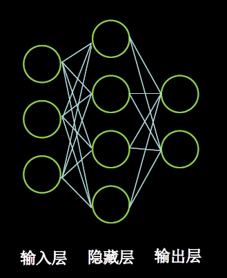

NN复杂度：多用NN层数和NN参数的个数表示

**空间复杂度:**

层数=隐藏层的层数+ 1个输出层

图中为：2层NN

总参数=总w+总b

第1层：3x4+4

第2层：4x2+2

图中共计：3x4+4 +4x2+2 = 26

**时间复杂度:**

乘加运算次数

第1层：3x4

第2层：4x2

图中共计：3x4 + 4x2 = 20

### 学习率

$$
w_{t+1}=w_{t}-l r * \frac{\partial l o s s}{\partial w_{t}}
$$

参数说明

- 更新后的参数
- 当前参数
- 学习率
- 损失函数的梯度（偏导数）

**指数衰减学习率**

可以先用较大的学习率，快速得到较优解，然后逐步减小学习率，使模型在训练后期稳定。
指数衰减学习率=初始学习率*学习率衰减率(当前轮数1多少轮衰减一次)

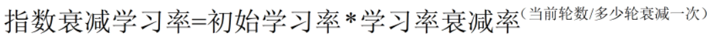

代码示例

```python
import tensorflow as tf

w = tf.Variable(tf.constant(5, dtype=tf.float32))

epoch = 20
LR_BASE = 0.2  # 最初学习率
LR_DECAY = 0.99  # 学习率衰减率
LR_STEP = 2  # 喂入多少轮BATCH_SIZE后，更新一次学习率

for epoch in range(epoch):  
# for epoch 定义顶层循环，表示对数据集循环epoch次，此例数据集数据仅有1个w,初始化时候constant赋值为5，循环40次迭代。
    lr = LR_BASE * LR_DECAY ** (epoch / LR_STEP)
    with tf.GradientTape() as tape:  # with结构到grads框起了梯度的计算过程。
        loss = tf.square(w + 1)
    grads = tape.gradient(loss, w)  # .gradient函数告知谁对谁求导

    w.assign_sub(lr * grads)  
    # .assign_sub 对变量做自减 即：w -= lr*grads 即 w = w - lr*grads
    if epoch%2 ==0:
        print("After %s epoch,w is %f,loss is %f,lr is %f" % (epoch, w.numpy(), loss, lr))
```

<!-- #region -->
## 激活函数

为什么要用激活函数：在神经网络中，如果不对上一层结点的输出做非线性转换的话，再深的网络也是线性模型，只能把输入线性组合再输出，不能学习到复杂的映射关系，因此需要使用激活函数这个非线性函数做转换。

参考：https://www.cnblogs.com/itmorn/p/11132494.html

### Sigmoid函数

$$
\begin{aligned}
&\operatorname{sigmod}(x)=\frac{1}{1+e^{-x}} \in(0,1)\\
&\operatorname{sigmod}^{\prime}(x)=\operatorname{sigmod}(x)^{*}(1-\operatorname{sigmod}(x))=\frac{1}{1+e^{-x}} * \frac{e^{-x}}{1+e^{-x}}=\frac{e^{-x}}{\left(1+e^{-x}\right)^{2}} \in(0,0.25)
\end{aligned}
$$

``` python
tf.nn.sigmoid(x)
```


sigmoid函数图像:

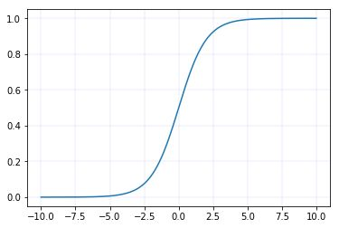

sigmoid导数图像:

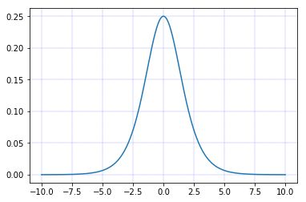

目前使用sigmoid函数为激活函数的神经网络已经很少了

特点

(1)易造成梯度消失

​		深层神经网络更新参数时，需要从输入层到输出层，逐层进行链式求导，而sigmoid函数的导数输出为[0,0.25]间的小数，链式求导需要多层导数连续相乘，这样会出现多个[0,0.25]间的小数连续相乘，从而造成结果趋于0，产生梯度消失，使得参数无法继续更新。

(2)输出非0均值，收敛慢

​		希望输入每层神经网络的特征是以0为均值的小数值，但sigmoid函数激活后的数据都时整数，使得收敛变慢。

(3)幂运算复杂，训练时间长

​		sigmoid函数存在幂运算，计算复杂度大。

### Tanh函数

$$
\begin{array}{l}
\tanh (x)=\frac{1-e^{-2 x}}{1+e^{-2 x}} \in(-1,1) \\
\tanh ^{\prime}(x)=1-(\tanh (x))^{2}=\frac{4 e^{-2 x}}{\left(1+e^{-2 x}\right)^{2}} \in(0,1]
\end{array}
$$


``` python
tf.math.tanh(x)
```


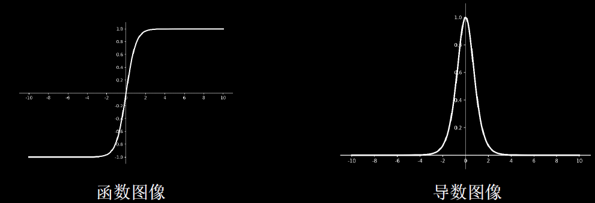

**特点**

(1)输出是0均值

(2)易造成梯度消失

(3)幂运算复杂，训练时间长

### Relu函数

$$
\begin{array}{l}
r e l u(x)=\max (x, 0)=\left\{\begin{array}{l}
x, \quad x \geq 0 \\
0, \quad x<0
\end{array} \in[0,+\infty)\right. \\
r e l u^{\prime}(x)=\left\{\begin{array}{ll}
1, & x \geq 0 \\
0, & x<0
\end{array} \in\{0,1\}\right.
\end{array}
$$

``` python
tf.nn.relu(x)
```


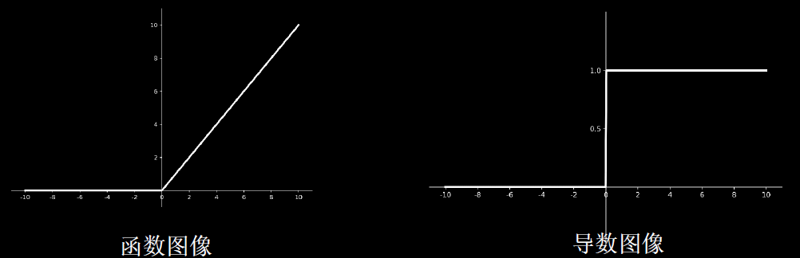

**优点:**

1. 解决了梯度消失问题(在正区间)
2. 只 需判断输入是否大于0，计算速度快
3. 收敛速度远快于sigmoid和tanh

**缺点:**

1. 输出非0均值，收敛慢
2. Dead ReIU问题:某些神经元可能永远不会被激活，导致相应的参数永远不能被更新。

### Leaky Relu函数

$$
\begin{aligned}
&\text { LeakyReLU }(x)=\left\{\begin{array}{ll}
x, & x \geq 0 \\
a x, & x<0
\end{array} \in R\right.\\
&\text { LeakyReL } U^{\prime}(x)=\left\{\begin{array}{ll}
1, & x \geq 0 \\
a, & x<0
\end{array} \in\{a, 1\}\right.
\end{aligned}
$$


``` python
tf.nn.leaky_relu(x)
``` 

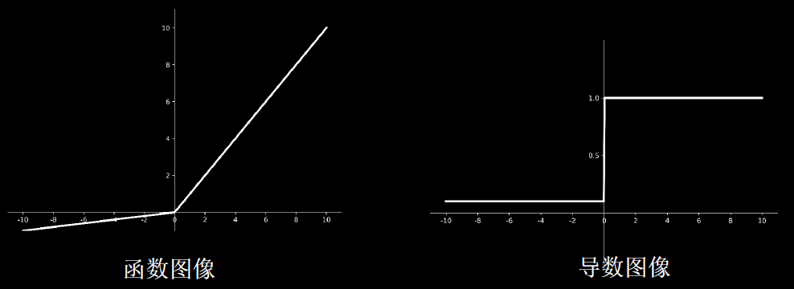

理论上来讲，Leaky Relu有Relu的所有优点，外加不会有Dead Relu问题，但是在实际操作当中，并没有完全证明Leaky Relu总是好于Relu。

### 总结

- 首选relu激活函数;
- 学习率设置较小值;
- 输入特征标准化，即让输入特征满足以0为均值，1为标准差的正态分布;
- 初始参数中心化，即让随机生成的参数满足以0为均值，下式为标准差的正态分布

$$
\sqrt{\frac{2}{\text { 当前层输入特征个数 }}}
$$

<!-- #endregion -->

## 损失函数

损失函数(loss) ：预测值(y) 与已知答案(y_) 的差距

NN优化目标：loss最小，有三种方法

- mse (Mean Squared Error)
- 自定义
- ce (Cross Entropy)

### 均方误差mes

$$
\operatorname{MSE}\left(y_{-}, y\right)=\frac{\sum_{i=1}^{n}\left(y-y_{-}\right)^{2}}{n}
$$

```
loss_mse = tf.reduce_mean(tf.square(y_ - y))
```

预测酸奶日销量y, x1、 x2是影响日销量的因素。

建模前，应预先采集的数据有:每日x1、x2和销量y_ (即已知答案，最佳情况:产量=销量)

拟造数据集X，Y_ : y_ =x1 + x2，噪声: -0.05~ +0.05

拟合可以预测销量的函数

代码示例

```python
import tensorflow as tf
import numpy as np

SEED = 23455

rdm = np.random.RandomState(seed=SEED) # 生成[0,1)之间的随机数
x = rdm.rand(32,2)
y_1 =[x1 + x2 + (rdm.rand()/10.0-0.05) for (x1,x2) in x] # 生成噪声[0,1)/10 -0.05=[-0.05,0.05);
y_ =[[x1 + x2 + (rdm.rand()/10.0-0.05)] for (x1,x2) in x] # 生成噪声[0,1)/10 -0.05=[-0.05,0.05);
print(x[:5])
print(y_1[:5])
print(y_[:5])
```

```python
x = tf.cast(x,dtype=tf.float32)
w1 = tf.Variable(tf.random.normal([2,1],seed=1))
print(w1)
```

```python
epochs = 200
lr = 0.2

for epoch in range(epochs):
    with tf.GradientTape()as tape:
        y = tf.matmul(x,w1)
        loss_mse = tf.reduce_mean(tf.square(y-y_))
    grads = tape.gradient(loss_mse,w1)
    w1.assign_sub(grads*lr)
    if epoch % 40 == 0:
        print("After %d training steps,w1 is " % (epoch))
        print(w1.numpy(), "\n")
print("Final w1 is: ", w1.numpy())
```

### 自定义损失函数

如预测商品销量，预测多了，损失成本;预测少了，损失利润

若利润≠成本，则mse产生的loss无法利益最大化。

自定义损失函数，y_：标准答案数据集的，y：预测答案计算出的
$$
\operatorname{loss}\left(y_{-} y\right)=\sum_{n} f\left(y_， y\right)
$$

$$
f\left(y_{-}, y\right)=\left\{\begin{array}{lll}\text { PROFIT* }\left(y_{-}-y\right) & y<y_{-} & \text {预测的 } y\text { 少了, 损失利高(PROFIT) } \\ \text { COST } *\left(y-y_{-}\right) & y>=y_{-} & \text {预测的 } y \text { 多了，损失成本(COST) }\end{array}\right.
$$

如:预测酸奶销量，酸奶成本(COST) 1元，酸奶利润(PROFIT) 99元。

预测少了损失利润99元，大于预测多了损失成本1元。预测少了损失大，希望生成的预测函数往多了预测。

则损失函数为：loss = tf.reduce_sum(tf.where(tf.greater(y, y_), (y - y_) * COST, (y_ - y) * PROFIT))

```python
import tensorflow as tf
import numpy as np

SEED = 23455
COST = 1
PROFIT = 99

rdm = np.random.RandomState(SEED)
x = rdm.rand(32, 2)
y_ = [[x1 + x2 + (rdm.rand() / 10.0 - 0.05)] for (x1, x2) in x]  # 生成噪声[0,1)/10=[0,0.1); [0,0.1)-0.05=[-0.05,0.05)
x = tf.cast(x, dtype=tf.float32)

w1 = tf.Variable(tf.random.normal([2, 1], stddev=1, seed=1))

epoch = 1000
lr = 0.002

for epoch in range(epoch):
    with tf.GradientTape() as tape:
        y = tf.matmul(x, w1)
        loss = tf.reduce_sum(tf.where(tf.greater(y, y_), (y - y_) * COST, (y_ - y) * PROFIT))

    grads = tape.gradient(loss, w1)
    w1.assign_sub(lr * grads)

    if epoch % 100 == 0:
        print("After %d training steps,w1 is " % (epoch))
        print(w1.numpy(), "\n")
print("Final w1 is: ", w1.numpy())
```

自定义损失函数，酸奶成本99元， 酸奶利润1元，成本很高，利润很低，人们希望多少预测，生成模型系数小于1，往少了预测。运行结果

```python
import tensorflow as tf
import numpy as np

SEED = 23455
COST = 99
PROFIT = 1

rdm = np.random.RandomState(SEED)
x = rdm.rand(32, 2)
y_ = [[x1 + x2 + (rdm.rand() / 10.0 - 0.05)] for (x1, x2) in x]  # 生成噪声[0,1)/10=[0,0.1); [0,0.1)-0.05=[-0.05,0.05)
x = tf.cast(x, dtype=tf.float32)

w1 = tf.Variable(tf.random.normal([2, 1], stddev=1, seed=1))

epoch = 1000
lr = 0.002

for epoch in range(epoch):
    with tf.GradientTape() as tape:
        y = tf.matmul(x, w1)
        loss = tf.reduce_sum(tf.where(tf.greater(y, y_), (y - y_) * COST, (y_ - y) * PROFIT))

    grads = tape.gradient(loss, w1)
    w1.assign_sub(lr * grads)

    if epoch % 100 == 0:
        print("After %d training steps,w1 is " % (epoch))
        print(w1.numpy(), "\n")
print("Final w1 is: ", w1.numpy())
```

### 交叉熵损失函数

交义熵损失函数CE (Cross Entropy)：表征两个概率分布之间的距离
$$
\mathrm{H}\left(\mathrm{y}_{-}, \mathrm{y}\right)=-\sum y_{-} * \ln y
$$
eg.二分类已知答案y_ =(1, 0)，预测y1=(0.6, 0.4) y2=(0.8, 0.2)哪个更接近标准答案?
$$
\begin{aligned}
&\mathrm{H}_{1}((1,0),(0.6,0.4))=-(1 * \ln 0.6+0 * \ln 0.4) \approx-(-0.511+0)=0.511\\
&\mathrm{H}_{2}((1,0),(0.8,0.2))=-(1 * \ln 0.8+0 * \ln 0.2) \approx-(-0.223+0)=0.223
\end{aligned}
$$
因为H> H2，所以y2预测更准：tf.losses.categorical crossentropy(y_ ，y)

```python
import tensorflow as tf

loss_ce1 = tf.losses.categorical_crossentropy([1, 0], [0.6, 0.4])
loss_ce2 = tf.losses.categorical_crossentropy([1, 0], [0.8, 0.2])
print("loss_ce1:", loss_ce1)
print("loss_ce2:", loss_ce2)

# 交叉熵损失函数
```

### 交叉熵损失函数与softmax结合

输出先过softmax函数，再计算y与y_ 的交叉熵损失函数。
tf.nn.softmax_cross_entropy_with_logits(y_, y)

```python
# softmax与交叉熵损失函数的结合
import tensorflow as tf
import numpy as np

y_ = np.array([[1, 0, 0], [0, 1, 0], [0, 0, 1], [1, 0, 0], [0, 1, 0]])
y = np.array([[12, 3, 2], [3, 10, 1], [1, 2, 5], [4, 6.5, 1.2], [3, 6, 1]])
y_pro = tf.nn.softmax(y)
print("y_pro:",y_pro)
loss_ce1 = tf.losses.categorical_crossentropy(y_,y_pro)
loss_ce2 = tf.nn.softmax_cross_entropy_with_logits(y_, y)

# softmax_cross_entropy_with_logits 是softmax与交叉熵损失函数的结合，可以直接计算出距离
tf.print('分步计算的结果:\n', loss_ce1)
tf.print('结合计算的结果:\n', loss_ce2)
```

## 过拟合与欠拟合

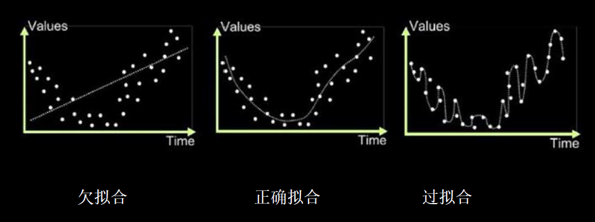

欠拟合的解决方法:

- 增加输入特征项
- 增加网络参数
- 减少正则化参数

过拟合的解决方法:

- 数据清洗
- 增大训练集
- 采用正则化
- 增大正则化参数

### 正则化缓解过拟合

正则化在损失函数中引入模型复杂度指标，利用给W加权值，弱化了训练数据的噪声(一般不正则化b)
$$
\operatorname{loss}=\operatorname{loss}\left(\mathrm{y}与{y}_{-}\right)+\mathrm{REGULARIZER}{*} \operatorname{loss}(\mathrm{w})
$$
式中含义：

`loss(y与y_)`：模型中所有参数的损失函数。如:交叉熵、均方误差

`REGULARIZER`：用超参数REGULARIZER给出参数w在总loss中的比例，即正则化的权重

`loss(w)`：需要正则化的参数。计算方式有两种
$$
\operatorname{loss}_{L_{1}}(w)=\sum_{i}\left|w_{i}\right|
$$

$$
\operatorname{loss}_{L 2}(w)=\sum_{i}\left|w_{i}^{2}\right|
$$

正则化的选择

- L1正则化大概率会使很多参数变为零，因此该方法可通过稀疏参数，即减少参数的数量，降低复杂度。
- L2正则化会使参数很接近零但不为零，因此该方法可通过减小参数值的大小降低复杂度。
  - `tf.nn.l2_loss(w)`

代码示例，未采用正则化`p29_regularizationfree.py`

```python
# 导入所需模块
import tensorflow as tf
from matplotlib import pyplot as plt
import numpy as np
import pandas as pd

# 读入数据/标签 生成x_train y_train
df = pd.read_csv('./data/dot.csv')
print("df:\n",df.head())
x_data = np.array(df[['x1', 'x2']])
y_data = np.array(df['y_c'])
print("x_data,y_data shape:",x_data.shape,y_data.shape)
print("xdata:\n",x_data[:5])
print("y_data:\n",y_data[:5])

# reshape(-1,x) -1是将一维数组转换为二维的矩阵，并且第二个参数是表示分成几列，-1代表意思是会自动根据列数x来计算行数
# 但是在reshape的时候必须让数组里面的个数和shape的函数做取余时值为零才能转换，就是行数*列数，等于原来元素的总数
# x_train = np.vstack(x_data).reshape(-1,2)
x_train = x_data #这里x_data 已经是二维数组了，可以不用转换了
y_train = np.vstack(y_data).reshape(-1,1)  #将y_data转换为二维数组
print("x_train,y_train shape:",x_train.shape,y_train.shape)
print("x_train:\n",x_train[:5])
print("y_train:\n",y_train[:5])

Y_c = [['red' if y else 'blue'] for y in y_train]  # 三元运算 标记不同的颜色
print("Y_c :",Y_c[:5])

# 转换x的数据类型，否则后面矩阵相乘时会因数据类型问题报错
x_train = tf.cast(x_train, tf.float32)
y_train = tf.cast(y_train, tf.float32)

# from_tensor_slices函数切分传入的张量的第一个维度，生成相应的数据集，使输入特征和标签值一一对应
train_db = tf.data.Dataset.from_tensor_slices((x_train, y_train)).batch(32)
tf.print("train_db:",train_db)
```

```python
# 生成神经网络的参数，输入层为2个神经元，隐藏层为11个神经元，1层隐藏层，输出层为1个神经元
# 隐藏层11个神经元为人为指定
# 用tf.Variable()保证参数可训练
w1 = tf.Variable(tf.random.normal([2, 11]), dtype=tf.float32)  # 隐藏层2个输入，11个输出
b1 = tf.Variable(tf.constant(0.01, shape=[11]))  # b的个数与w个数相同

w2 = tf.Variable(tf.random.normal([11, 1]), dtype=tf.float32)  # 输出层接收11个，输出1个
b2 = tf.Variable(tf.constant(0.01, shape=[1]))

lr = 0.01  # 学习率
epoch = 400  # 循环轮数
tf.print("w1:",w1)
tf.print("b1:",b1)
tf.print("w2:",w2)
tf.print("b2:",b2)
```

**没有加入正则化**

```python
# 训练部分
for epoch in range(epoch):
    for step, (x_train, y_train) in enumerate(train_db):
        with tf.GradientTape() as tape:  # 记录梯度信息

            h1 = tf.matmul(x_train, w1) + b1  # 记录神经网络乘加运算
            h1 = tf.nn.relu(h1)  # relu激活函数
            y = tf.matmul(h1, w2) + b2

            # 采用均方误差损失函数mse = mean(sum(y-out)^2)
            loss = tf.reduce_mean(tf.square(y_train - y))

        # 计算loss对各个参数的梯度
        variables = [w1, b1, w2, b2]
        grads = tape.gradient(loss, variables)

        # 实现梯度更新
        # w1 = w1 - lr * w1_grad tape.gradient是自动求导结果与[w1, b1, w2, b2] 索引为0，1，2，3 
        w1.assign_sub(lr * grads[0])
        b1.assign_sub(lr * grads[1])
        w2.assign_sub(lr * grads[2])
        b2.assign_sub(lr * grads[3])

    # 每20个epoch，打印loss信息
    if epoch % 40 == 0:
        print('epoch:', epoch, 'loss:', float(loss))

# 预测部分
print("*******predict*******")
# xx在-3到3之间以步长为0.01，yy在-3到3之间以步长0.01,生成间隔数值点
xx, yy = np.mgrid[-3:3:.1, -3:3:.1]
# 将xx , yy拉直，并合并配对为二维张量，生成二维坐标点
grid = np.c_[xx.ravel(), yy.ravel()]
grid = tf.cast(grid, tf.float32)
# 将网格坐标点喂入神经网络，进行预测，probs为输出
probs = []
for x_test in grid:
    # 使用训练好的参数进行预测
    h1 = tf.matmul([x_test], w1) + b1
    h1 = tf.nn.relu(h1)
    y = tf.matmul(h1, w2) + b2  # y为预测结果
    probs.append(y)

# 取第0列给x1，取第1列给x2
x1 = x_data[:, 0]
x2 = x_data[:, 1]
# probs的shape调整成xx的样子
probs = np.array(probs).reshape(xx.shape)
plt.scatter(x1, x2, color=np.squeeze(Y_c)) # squeeze去掉纬度是1的纬度,相当于去掉[['red'],['blue']],内层括号变为['red','blue']
# 当时写列表表达式的时候就不用那么麻烦，写成二维数组

# 把坐标xx yy和对应的值probs放入contour<[‘kɑntʊr]>函数，给probs值为0.5的所有点上色  plt点show后 显示的是红蓝点的分界线
plt.contour(xx, yy, probs, levels=[.5])  # 画出probs值为0.5轮廓线,levels:这个参数用于显示具体哪几条登高线
plt.show()

# 读入红蓝点，画出分割线，不包含正则化
```

**L1 正则 **

```python
# 生成神经网络的参数，输入层为2个神经元，隐藏层为11个神经元，1层隐藏层，输出层为1个神经元
# 隐藏层11个神经元为人为指定
# 用tf.Variable()保证参数可训练
w1 = tf.Variable(tf.random.normal([2, 11]), dtype=tf.float32)  # 隐藏层2个输入，11个输出
b1 = tf.Variable(tf.constant(0.1, shape=[11]))  # b的个数与w个数相同

w2 = tf.Variable(tf.random.normal([11, 1]), dtype=tf.float32)  # 输出层接收11个，输出1个
b2 = tf.Variable(tf.constant(0.4, shape=[1]))

lr = 0.01  # 学习率
epoch = 400  # 循环轮数
# 训练部分
for epoch in range(epoch):
    for step, (x_train, y_train) in enumerate(train_db):
        with tf.GradientTape() as tape:  # 记录梯度信息

            h1 = tf.matmul(x_train, w1) + b1  # 记录神经网络乘加运算
            h1 = tf.nn.relu(h1)  # relu激活函数
            y = tf.matmul(h1, w2) + b2

            # 采用均方误差损失函数mse = mean(sum(y-out)^2)
            loss_mse = tf.reduce_mean(tf.square(y_train - y))
            # 添加L1正则化
            loss_regularization = []
            # 取绝对值,累加
            loss_regularization.append(tf.reduce_sum(tf.math.abs(w1)))
            loss_regularization.append(tf.reduce_sum(tf.math.abs(w2)))
            # 求和
            loss_regularization = tf.reduce_sum(loss_regularization)
            loss = loss_mse + 0.005 * loss_regularization # REGULARIZER = 0.05

        # 计算loss对各个参数的梯度
#         variables = [w1, b1, w2, b2]
        variables = [w1, w2]
        grads = tape.gradient(loss, variables)

        # 实现梯度更新
        # w1 = w1 - lr * w1_grad tape.gradient是自动求导结果与[w1, b1, w2, b2] 索引为0，1，2，3 
        w1.assign_sub(lr * grads[0])
#         b1.assign_sub(lr * grads[1])
        w2.assign_sub(lr * grads[1])
#         b2.assign_sub(lr * grads[3])

    # 每20个epoch，打印loss信息
    if epoch % 40 == 0:
        print('epoch:', epoch, 'loss:', float(loss))

# 预测部分
print("*******predict*******")
# xx在-3到3之间以步长为0.01，yy在-3到3之间以步长0.01,生成间隔数值点
xx, yy = np.mgrid[-3:3:.1, -3:3:.1]
# 将xx , yy拉直，并合并配对为二维张量，生成二维坐标点
grid = np.c_[xx.ravel(), yy.ravel()]
grid = tf.cast(grid, tf.float32)
# 将网格坐标点喂入神经网络，进行预测，probs为输出
probs = []
for x_test in grid:
    # 使用训练好的参数进行预测
    h1 = tf.matmul([x_test], w1) + b1
    h1 = tf.nn.relu(h1)
    y = tf.matmul(h1, w2) + b2  # y为预测结果
    probs.append(y)

# 取第0列给x1，取第1列给x2
x1 = x_data[:, 0]
x2 = x_data[:, 1]
# probs的shape调整成xx的样子
probs = np.array(probs).reshape(xx.shape)
plt.scatter(x1, x2, color=np.squeeze(Y_c)) # squeeze去掉纬度是1的纬度,相当于去掉[['red'],['blue']],内层括号变为['red','blue']
# 当时写列表表达式的时候就不用那么麻烦，写成二维数组

# 把坐标xx yy和对应的值probs放入contour<[‘kɑntʊr]>函数，给probs值为0.5的所有点上色  plt点show后 显示的是红蓝点的分界线
plt.contour(xx, yy, probs, levels=[.5])  # 画出probs值为0.5轮廓线,levels:这个参数用于显示具体哪几条登高线
plt.show()

# L1正则比较适合大量的稀疏的参数，因为齐总很多参数是没有贡献的
```

```python
# 生成神经网络的参数，输入层为4个神经元，隐藏层为32个神经元，2层隐藏层，输出层为3个神经元
# 用tf.Variable()保证参数可训练
w1 = tf.Variable(tf.random.normal([2, 11]), dtype=tf.float32)
b1 = tf.Variable(tf.constant(0.01, shape=[11]))

w2 = tf.Variable(tf.random.normal([11, 1]), dtype=tf.float32)
b2 = tf.Variable(tf.constant(0.01, shape=[1]))

lr = 0.01  # 学习率
epoch = 400  # 循环轮数
# 训练部分
for epoch in range(epoch):
    for step, (x_train, y_train) in enumerate(train_db):
        with tf.GradientTape() as tape:  # 记录梯度信息

            h1 = tf.matmul(x_train, w1) + b1  # 记录神经网络乘加运算
            h1 = tf.nn.relu(h1)  # relu激活函数
            y = tf.matmul(h1, w2) + b2

            # 采用均方误差损失函数mse = mean(sum(y-out)^2)
            loss_mse = tf.reduce_mean(tf.square(y_train - y))
            # 添加L2正则化
            loss_regularization = []
            # tf.nn.l2_loss(w)=sum(w ** 2) / 2
            loss_regularization.append(tf.nn.l2_loss(w1))
            loss_regularization.append(tf.nn.l2_loss(w2))
            # 求和
            loss_regularization = tf.reduce_sum(loss_regularization)
            loss = loss_mse + 0.03 * loss_regularization # REGULARIZER = 0.03

        # 计算loss对各个参数的梯度
        variables = [w1, b1, w2, b2]
        grads = tape.gradient(loss, variables)

        # 实现梯度更新
        # w1 = w1 - lr * w1_grad tape.gradient是自动求导结果与[w1, b1, w2, b2] 索引为0，1，2，3 
        w1.assign_sub(lr * grads[0])
        b1.assign_sub(lr * grads[1])
        w2.assign_sub(lr * grads[2])
        b2.assign_sub(lr * grads[3])

    # 每20个epoch，打印loss信息
    if epoch % 40 == 0:
        print('epoch:', epoch, 'loss:', float(loss))

# 预测部分
print("*******predict*******")
# xx在-3到3之间以步长为0.01，yy在-3到3之间以步长0.01,生成间隔数值点
xx, yy = np.mgrid[-3:3:.1, -3:3:.1]
# 将xx , yy拉直，并合并配对为二维张量，生成二维坐标点
grid = np.c_[xx.ravel(), yy.ravel()]
grid = tf.cast(grid, tf.float32)
# 将网格坐标点喂入神经网络，进行预测，probs为输出
probs = []
for x_test in grid:
    # 使用训练好的参数进行预测
    h1 = tf.matmul([x_test], w1) + b1
    h1 = tf.nn.relu(h1)
    y = tf.matmul(h1, w2) + b2  # y为预测结果
    probs.append(y)

# 取第0列给x1，取第1列给x2
x1 = x_data[:, 0]
x2 = x_data[:, 1]
# probs的shape调整成xx的样子
probs = np.array(probs).reshape(xx.shape)
plt.scatter(x1, x2, color=np.squeeze(Y_c)) # squeeze去掉纬度是1的纬度,相当于去掉[['red'],['blue']],内层括号变为['red','blue']
# 当时写列表表达式的时候就不用那么麻烦，写成二维数组

# 把坐标xx yy和对应的值probs放入contour<[‘kɑntʊr]>函数，给probs值为0.5的所有点上色  plt点show后 显示的是红蓝点的分界线
plt.contour(xx, yy, probs, levels=[.5])  # 画出probs值为0.5轮廓线,levels:这个参数用于显示具体哪几条登高线
plt.show()
```

## 神经网络参数优化器

**优化器**：是引导神经网络更新参数的工具

**作用**：用来更新和计算影响模型训练和模型输出的网络参数，使其逼近或达到最优值，从而最小化(或最大化)损失函数

待优化参数w，损失函数loss, 学习率lr， 每次迭代个batch（每个batch包含2^n组数据），t表示当前batch迭代的总次数:

1.计算t时刻损失函数关于当前参数的梯度
$$
g_{t}=\nabla \operatorname{loss}=\frac{\partial \operatorname{loss}}{\partial\left(w_{t}\right)}
$$
2.计算t时刻一阶动量mt和二阶动量Vt

- 一阶动量:与梯度相关的函数
- 二阶动量:与梯度平方相关的函数

3.计算t时刻下降梯度:
$$
\eta_{\mathrm{t}}=l r \cdot m_{\mathrm{t}} / \sqrt{V_{\mathrm{t}}}
$$
4.计算t+1时刻参数
$$
w_{\mathrm{t}+1}=w_{t}-\eta_{t}=w_{t}-l r \cdot m_{t} / \sqrt{V_{t}}
$$
不同的优化器实质上只是定义了不同的一阶动量和二阶动量公式

### SGD 随机梯度下降

SGD (无momentum)，常用的梯度下降法。
$$
m_{\mathrm{t}}=g_{\mathrm{t}} \quad V_{\mathrm{t}}=1
$$

$$
\boldsymbol{\eta}_{\mathrm{t}}=\boldsymbol{l} \boldsymbol{r} \cdot \boldsymbol{m}_{\mathrm{t}} / \sqrt{\boldsymbol{V}_{t}}=\boldsymbol{l} \boldsymbol{r} \cdot \boldsymbol{g}_{t}
$$

$$
\begin{aligned}
w_{t+1}=& w_{t}-\eta_{t} \\
&=w_{t}-l r \cdot m_{t} / \sqrt{v_{t}}=w_{t}-lr \cdot g_{t}
\end{aligned}
$$

即为
$$
\mathrm{w}_{\mathrm{t}+1}=w_{t}-l r * \frac{\partial l o s s}{\partial w_{t}}
$$

### SGDM

( SGDM (含momentum的SGD)，在SGD基础上增加一 阶动量。
$$
m_{\mathrm{t}}=\beta \cdot m_{t-1}+(1-\beta) \cdot g_{t}
$$
mt：表示各时刻梯度方向的指数滑动平均值

β：超参数，趋近于1，经验值为0.9
$$
V_{\mathrm{t}}=1
$$

$$
\begin{aligned}
\eta_{\mathrm{t}}=& \operatorname{lr} \cdot m_{\mathrm{t}} / \sqrt{V_{\mathrm{t}}}=\operatorname{lr} \cdot m_{\mathrm{t}} \\
&=\operatorname{lr} \cdot\left(\beta \cdot m_{\mathrm{t}-1}+(1-\beta) \cdot g_{\mathrm{t}}\right)
\end{aligned}
$$

$$
\begin{aligned}
w_{\mathrm{t}+1}=& w_{\mathrm{t}}-\eta_{\mathrm{t}} \\
&=w_{\mathrm{t}}-l r \cdot\left(\beta \cdot m_{\mathrm{t}-1}+(1-\beta) \cdot g_{\mathrm{t}}\right)
\end{aligned}
$$

### Adagrad

Adagrad, 在SGD基础上增加二阶动量
$$
m_{\mathrm{t}}=g_{\mathrm{t}}
$$
二阶动量是从开始到现在梯度平方的累计和:
$$
V_{t}=\sum_{\tau=1}^{t} g_{\tau}^{2}
$$

$$
\begin{array}{l}
\eta_{\mathrm{t}}=lr \cdot m_{t} /(\sqrt{V_{t}}) \\
\quad=lr \cdot g_{t} /(\sqrt{\sum_{\tau=1}^{t} g_{t}^{2}})
\end{array}
$$

$$
\begin{aligned}
w_{t+1}=& w_{t}-\eta_{t} \\
&=w_{t}-lr \cdot g_{t} /(\sqrt{\sum_{\tau=1}^{t} g_{t}^{2}})
\end{aligned}
$$

### RMSProp

RMSProp, SGD基础上增加二 阶动量
$$
m_{\mathrm{t}}=g_{\mathrm{t}}
$$
二阶动量v使用指数滑动平均值计算，表征的是过去一段时间的平均值
$$
V_{t}=\beta \cdot V_{t-1}+(1-\beta) \cdot g_{t}^{2}
$$

$$
\begin{aligned}
\eta_{t}=& l r \cdot m_{\mathrm{t}} / \sqrt{V_{\mathrm{t}}} \\
&=lr \cdot g_{t} /(\sqrt{\beta \cdot V_{t-1}+(1-\beta) \cdot g_{t}^{2}})
\end{aligned}
$$

$$
\begin{aligned}
w_{t+1} &=w_{t}-\eta_{t} \\
&=w_{t}-lr \cdot g_{t} /(\sqrt{\beta \cdot V_{t-1}+(1-\beta) \cdot g_{t}^{2}})
\end{aligned}
$$

### Adam

Adam，同时结合SGDM一阶动量和RMSProp二阶动量

一阶动量：
$$
m_{\mathrm{t}}=\beta_{1} \cdot m_{t-1}+\left(1-\beta_{1}\right) \cdot g_{t}
$$
修正一阶动量的偏差，t为从训练开始到当前时刻所经历的总batch数::
$$
\widehat{m}_{\mathrm{t}}=\frac{m_{\mathrm{t}}}{1-\beta_{1}^{t}}
$$
二阶动量：
$$
V_{t}=\beta_{2} \cdot V_{s t e p-1}+\left(1-\beta_{2}\right) \cdot g_{t}^{2}
$$
修正二阶动量的偏差，t为从训练开始到当前时刻所经历的总batch数:
$$
\widehat{V_{t}}=\frac{V_{t}}{1-\beta_{2}^{t}}
$$

$$
\begin{aligned}
\eta_{t}=& lr \cdot \widehat{m}_{\mathrm{t}} / \sqrt{\widehat{V}_{t}} \\
&=\operatorname{lr} \cdot \frac{m_{\mathrm{t}}}{1-\beta_{1}^{t}} / \sqrt{\frac{V_{t}}{1-\beta_{2}^{t}}}
\end{aligned}
$$

$$
\begin{aligned}
w_{t+1} &=w_{t}-\eta_{t} \\
&=w_{t}-l r \cdot \frac{m_{t}}{1-\beta_{1}^{t}} / \sqrt{\frac{v_{t}}{1-\beta_{2}^{t}}}
\end{aligned}
$$

### 优化器对比

class2中代码p32-p40

#### SGD

loss图像

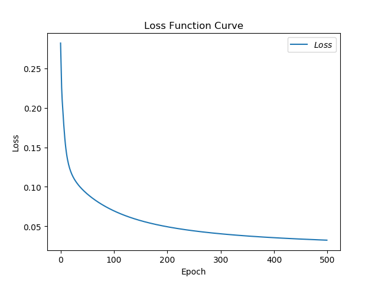

acc图像

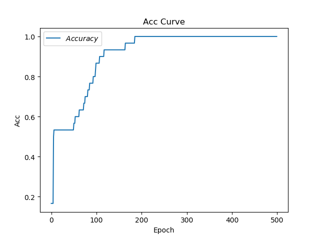

耗时：12.678699254989624

#### SGDM

loss图像

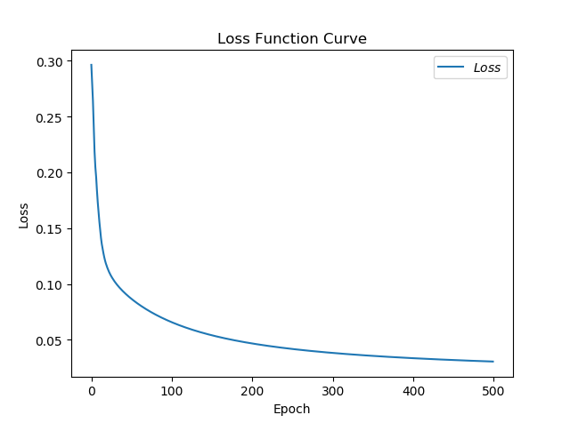

acc图像

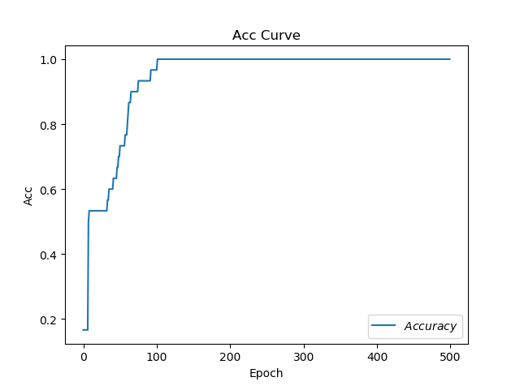

耗时：17.32265305519104

#### Adagrad

loss图像

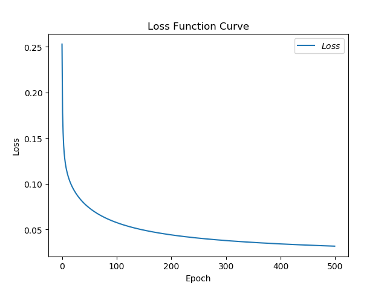

acc图像

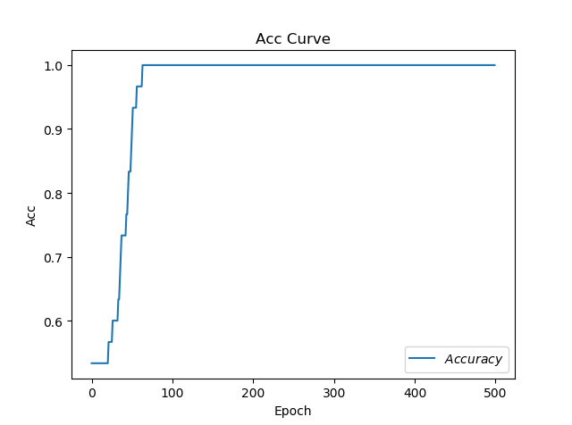

耗时：13.080469131469727

#### RMSProp

loss图像

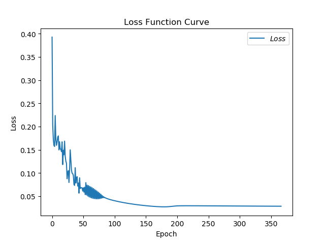

acc图像

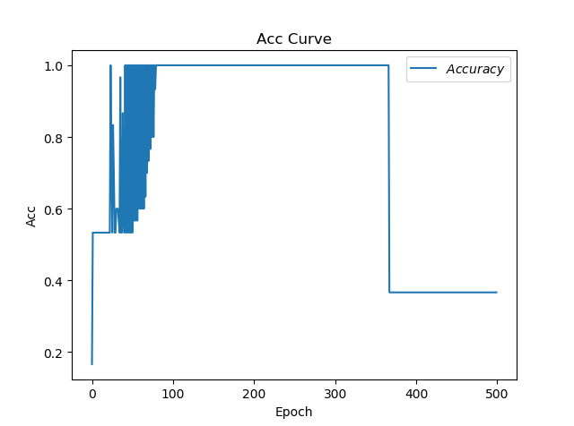

耗时：16.42955780029297

#### Adam

loss图像

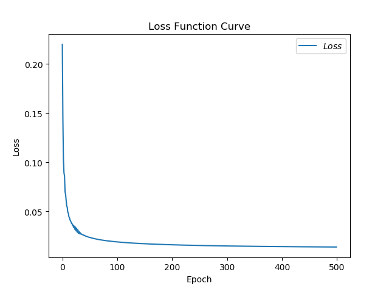

acc图像

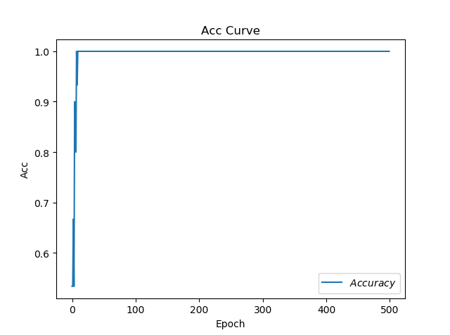

耗时：22.04225492477417  

```python
# todo 优化器的python代码实现
```
