---
jupyter:
  jupytext:
    text_representation:
      extension: .md
      format_name: markdown
      format_version: '1.2'
      jupytext_version: 1.6.0
  kernelspec:
    display_name: Python 3
    language: python
    name: python3
---

# 五、卷积神经网络


## 卷积计算过程

全连接NN：每个神经元与前后相邻层的每个神经元都有连接关系，输入是特征，输出为预测的结果。

全连接神经网络参数个数：
$$
\sum_{\text {各层 }}(\text { 前层 } \times \text { 后层 }+\text { 后层 })
$$

- w：前层*后层
- b：后层


上一讲图片识别中，每张图片28*28个点，128个神经元参数个数为：

- 第一层参数：`28*28*128个w+128个b`
- 第二层参数：`128*10个w+10个b`

共计：101770个参数

​		实际项目中的图片多是高分辨率彩色图，待优化参数过多容易造成模型过拟合。

​		实际应用时会先对原始图像进行特征提取，再把提取到的特征送给全连接网络。

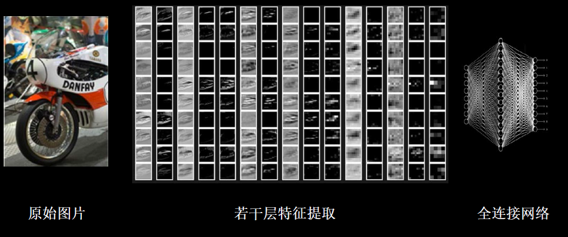

​		卷积计算可认为是一种有效提取图像特征的方法。

​		一般会用一个正方形的卷积核，按指定步长，在输入特征图上滑动遍历输入特征图中的每个像素点。每一个步长，卷积核会与输入特征图出现重合区域，重合区域对应元素相乘、求和再加上偏置项，得到输出特征的一个像素点。

- 如果输入特征是单通道灰度图，深度为1的单通道卷积核
- 如果输入特征是三通道彩色图，一个`3*3*3`的卷积核或`5*5*3`的卷积核

总之要使卷积核的通道数与输入特征图的通道数一致。因为要想让卷积核与输入特征图对应点匹配上，必须让卷积核的深度与输入特征图的深度一致。

**输入特征图的深度(channel数)，决定了当前层卷积核的深度。**

​		由于每个卷积核在卷积计算后，会得到张输出特征图，所以当前层使用了几个卷积核，就有几张输出特征图。

**当前层卷积核的个数，决定了当前层输出特征图的深度。**

如果觉得某层模型的特征提取能力不足，可以在这一层多用几个卷积核提高这一层的特征提取能力。

卷积核示意图：

`3*3*1`卷积核，每个核3*3+1=10个参数

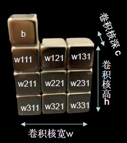

`3*3*3`卷积核，每个核`3*3*3+1=28`个参数

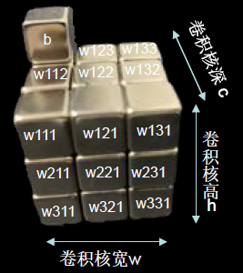

`5*5*3`卷积核，每个核`5*5*3+1=76`个参数


​		里面的每一个小颗粒都存储着一个待训练参数，在执行卷积计算时，卷积核里的参数时固定的，在每次反向传播时，这些小颗粒中存储的待训练参数，会被梯度下降法更新。卷积就是利用立体卷积核，实现参数共享。

​		例如输入特征图为单通道，卷积核在输入特征图上滑动，每滑动一步输入特征图与卷积核里的9个元素重合，对应元素相乘求和再加上偏置项b，得到输出特征图中的一个像素值。

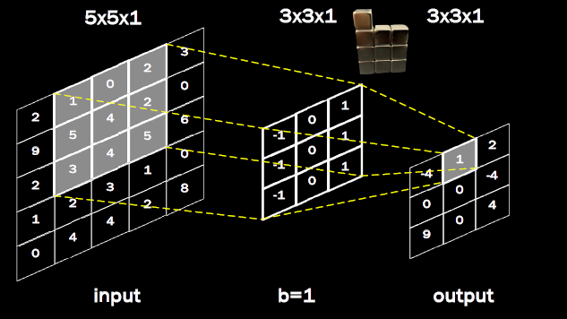

计算过程：`(-1)*1+0*0+1 *2+(-1)*5+0*4+1*2+(-1)*3+0*4+1*5+1=1`

​		输入特征为3通道的，选用3通道卷积核。本例中输入是是5行5列红绿蓝三通道数据，选用我选用了3*3三通道卷积核，滑动步长是1，在输入特征图上滑动，每滑动一步输入特征图与卷积核里的27个元素重合。


动图理解


​		帮助你理解卷积核在输入特征图上按指定步长滑动，每个步长卷积核会与输入特征图上部分像素点重合，重合区域输入特征图与卷积核对应元素相乘求和，得到输出特征图中的一个像素点，当输入特征图被遍历完成，得到一张输出特征图，完成了一个卷积核的卷积计算过程。当有n个卷积核时，会有n张输出特征图，叠加在这张输出特征图的后面。


## 感受野

感受野(Receptive Field) :卷积神经网络各输出特征图中的每个像素点，在原始输入图片上映射区域的大小。

参考：https://www.cnblogs.com/shine-lee/p/12069176.html

例如：对于输入特征为`5*5`的图片，其中卷积核（filter）的步长（stride）为1、padding为0。

​		用黄色`3*3`的卷积核卷积操作，第一层这个输出特征图上的每个像素点，映射到原始图片是`3*3`的区域，所以这一层感受野为3。如果再对这个`3*3`的特征图，用这个绿色的`3*3`卷积核作用，会输出一个`1*1`的输出特征图，这个输出特征图上的像素点，映射到原始图片是5*5的区域，所以感受野为5。

​		如果对这个`5*5`的原始输入图片，直接用蓝色的`5*5`卷积核作用，会输出一个`1*1`的输出特征图，这个像素点映射到原始输入图片是5*5的区域，所以它的感受野也是5。

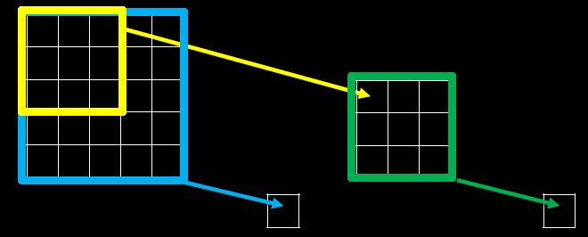

​		同样一个`5*5`的原始输入图片,经过两层`3*3`的卷积核作用，和经过一层`5*5`的卷积核作用,都得到一个感受野是5的输出特征图。所以这两种方式特征提取能力是一致的。

​		是选择两层`3*3`卷积运算的好，还是一层`5*5`卷积运算的好？需要考虑他们所承载的待训练参数量和计算量。

​		设输入特征图宽、高为x，卷积计算步长为1，卷积核为`n*n`

每个`n*n*1`的卷积核经过`n^2`计算得到一个输出像素点，得到的特征图为`(x-(n-1))^2`大小，所以计算量计算公式：
$$
n{^2}*(x - (n -1) {^2} + n{^2}*(x - 2*(n -1) {^2} + .......
$$
对于两层`3*3`卷积运算

参数量：`3*3`+`3*3`=18

计算量：
$$
3*3*(x-2)^{\wedge} 2+3*3*(x-4)^{\wedge} 2
$$
对于一层`5*5`卷积运算

参数量：5*5=25

计算量：
$$
5*5*(x-4)^{\wedge} 2
$$
当x>10时，两层`3*3`卷积核 优于一层`5*5`卷积核，这也就是为什么现在的神经网络在卷积计算中，常用使用两层`3*3`卷积核


## 全零填充

为保证卷积计算保持输入特征图的尺寸不变，可以使用全零填充，在输入特征图周围填充0，

例如对`5*5*1`的输入特征图经过全零填充后，再通过`3*3*1`的卷积核，进行进行步长为1的卷积计算，输出特征图仍是`5*5*1`

输出图片边长=输入图片边长/步长
此图:`5/1=5`

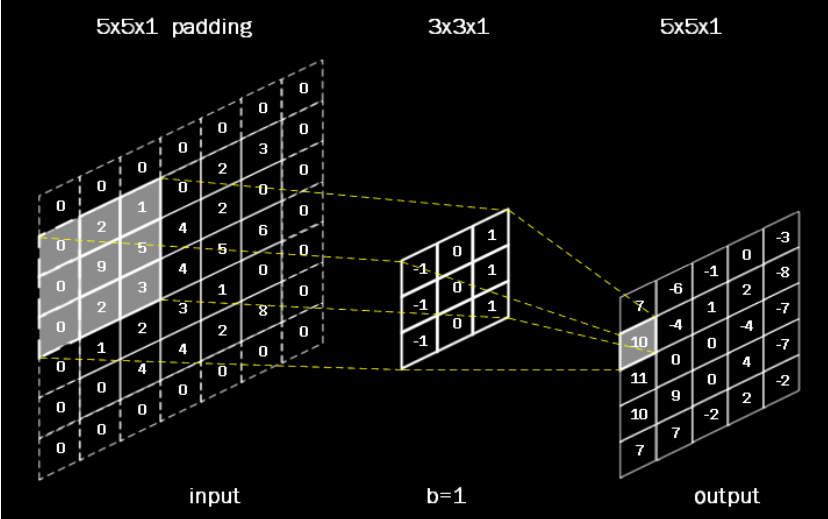

卷积输出特征图维度计算公式

SAME（全零填充）向上取整，例如2.3取3:
$$
padding =\frac{\text { 输入特征图边长 }}{\text { 步长 }}
$$

VALID（不全0填充）向上取整：
$$
padding =\frac{\text {输入特征图边长 }-\text { 卷积核长 } +1}{\text {步长}}
$$
TF描述是否全零填充

- 用参数`padding = 'SAME`'表示使用全零填充
- 用参数`padding = 'VALID'`表示不使用全零填充

示例：

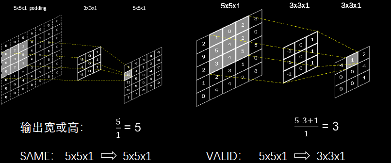


<!-- #region -->
## TF描述卷积计算层

Tensorflow给出了计算卷积的函数

``` python
tf.keras.layers.Conv2D (
	filters =卷积核个数，
	kernel_size =卷积核尺寸，# 正方形写核长整数，或(核高h,核宽w)
	strides =滑动步长，# 横纵向相同写步长整数，或纵向步长h，横向步长w)， 默认1
	padding = "same" or "Valid", # 使用全零填充是"same",不使用是"valid" (默认)
	activation =“relu”or“sigmoid”or“tanh”or“softmax"等，# 如有BN此处不写
	input_shape = (高，宽，通道数)  # 输入特征图维度，可省略
)
```
示例
<!-- #endregion -->

```python
import tensorflow as tf
import os
import numpy as np
from matplotlib import pyplot as plt
from tensorflow.keras.layers import Conv2D, BatchNormalization, Activation, MaxPool2D, Dropout, Flatten, Dense
from tensorflow.keras import Model

model = tf.keras.models.Sequential([
	Conv2D(6,5,padding='valid', activation='sigmoid'),
	MaxPool2D(2,2),
	Conv2D(6, (5, 5),padding='valid', activation= 'sigmoid'),
	MaxPool2D(2, (2, 2)),
	Conv2D(filters=6,kernel_size=(5,5), padding='valid', activation= 'sigmoid' ),
	MaxPool2D(pool_size=(2, 2), strides=2),
	Flatten(),
	Dense(10, activation='softmax')
])
```

<!-- #region -->
## 批标准化(BN)

批标准化(Batch Normalization, BN)

​		神经网络对0附近的数据更敏感，但是随着网络层数的增加，特征数据会出现偏离0均值的情况。

- **标准化**：可以使数据符合以0为均值，1为标准差的分布。把偏移的特征数据重新拉回到0附近。
- **批标准化**：对一小批数据(batch) ，做标准化处理。使数据回归标准正态分布，常用在卷积操作和激活操作之间。

可以通过下方的式子计算批标准化后的输出特征图，得到第k个卷积核的输出特征图(feature map)中的第i个像素点。批标准化操作，会让每个像素点进行减均值除以标准差的自更新计算。
$$
H_{i}^{'k}=\frac{H_{i}^{k}-\mu_{\mathrm{batch}}^{k}}{\sigma_{\mathrm{batch}}^{k}}
$$

$$
H_{i}^{k}：批标准化前，第k个卷积核，输出特征图中第i个像素点
$$

$$
\mu_{\mathrm{batch}}^{k}：批标准化前，第k个卷积核，batch张 输出特征图中所有像素点平均值
$$

$$
\boldsymbol{\mu}_{\text {batch }}^{k}=\frac{\mathbf{1}}{m} \sum_{i=1}^{m} H_{i}^{k}
$$

$$
\sigma_{\text {batch }}^{k}=\sqrt{\delta+\frac{1}{m} \sum_{i=1}^{m}\left(H_{i}^{k}-\mu_{\text {batch }}^{k}\right)^{2}}
$$

$$
{\sigma_{\mathrm{batch}}^{k}}：批标准化前，第k个卷积核。batch张输出特征图中所有像素点标准差
$$

$$
\sigma_{\text {batch }}^{k}=\sqrt{\delta+\frac{1}{m} \sum_{i=1}^{m}\left(H_{i}^{k}-\mu_{\text {batch }}^{k}\right)^{2}}
$$


​		BN操作将原本偏移的特征数据，重新拉回到0均值，使进入激活函数的数据分布在激活函数线性区，使得输入数据的微小变化，更明显的体现到激活函数的输出，提升了激活函数对输入数据的区分力。


$$
x_{i}^{k}=\gamma_{k} H_{i}^{\prime k}+\beta_{k}
$$
​		反向传播时，缩放因子γ和偏移因子β会与其他待训练参数一同被训练优化，使标准正态分布后的特征数据，通过缩放因子和偏移因子，优化了特征数据分布的宽窄和偏移量，保证了网络的非线性表达力。


BN层位于卷积层之后，激活层之前。TF描述批标准化
``` python
tf.keras.layers.BatchNormalization()
```
<!-- #endregion -->

```python
model = tf.keras.models.Sequential([
	Conv2D(filters=6,kernel_size=(5, 5),padding="same"),#卷积层
	BatchNormalization(),# BN层
	Activation("relu"), # 微祜层
	MaxPool2D(pool_size=(2, 2),strides=2,padding="same"), # 池化层
	Dropout(0.2),# dropout层
])
```

<!-- #region -->
## 池化

池化操作用于减少告积神经网络中特征数据量。

- 最大值池化可提取图片纹理
- 均值池化可保留背景特征

如果用`2*2`的池化核对输入图片以2为步长进行池化，输出图片将变为输入图片的四分之一大小。

最大池化：是用2*2的池化核框住4个像素点，选择每次框住4个像素点中最大的值输出，直到遍历完整幅图片。

均值池:是用2*2的池化核框住4个像素点，每次输出四个像素点的均值，直到遍历完整幅图片。


**Tensorflow池化函数**

最大值池化
``` python
tf.keras.layers.MaxPool2D(
	pool_size=池化核尺寸， # 正方形写核长整数，或(核高h，核宽w)
	strides=池化步长， #步长整数，或(纵向步长h,横向步长w)，默认为pool_size
	padding='valid'or'same' #使用全零填充是"same"，不使用是"valid" (默认)
)
```
均值池化
``` python
tf.keras.layers.AveragePooling2D(
	pool_size=池化核尺寸， # 正方形写核长整数，或(核高h，核宽w)
	strides=池化步长， #步长整数，或(纵向步长h,横向步长w)，默认为pool_size
	padding='valid'or'same' #使用全零填充是"same"，不使用是"valid" (默认)
)
```

补充：GlobalAveragePooling2D是平均池化的一个特例，它不需要指定pool_size和strides等参数，操作的实质是将输入特征图的每一个通道求平均得到一个数值。


示例
<!-- #endregion -->

```python
model = tf.keras.models.Sequential([
	Conv2D(filters=6,kernel_size=(5, 5),padding='same'),#卷积层
	BatchNormalization(),# BN层
	Activation('relu'), # 激活层
	MaxPool2D(pool_size=(2, 2),strides=2,padding='same'), # 池化层
	Dropout(0.2),# dropout层
])
```

<!-- #region -->
# 舍弃

为了缓解神经网络过拟合，在神经网络训练过程中，常把隐藏层的部分神经元按照一定比例从神经网络中临时舍弃，在使用神经网络时再把所有神经元恢复到神经网络中。


**Tensorflow舍弃函数**
``` python
tf.keras.layers.Dropout(舍弃的概率)
```
示例
<!-- #endregion -->

```python
model = tf.keras.models.Sequential([
	Conv2D(filters=6,kernel_size=(5, 5),padding='same'),#卷积层
	BatchNormalization(),# BN层
	Activation('relu'), # 激活层
	MaxPool2D(pool_size=(2, 2),strides=2,padding='same'), # 池化层
	Dropout(0.2),# dropout层
])
```

<!-- #region -->
## 卷积神经网络

卷积神经网络:卷积神经网络就是借助卷积核对输入特征进行特征提取，再把提取到的特征送入全连接网络进行识别预测。

卷积神经网络网络的主要模块


**卷积是什么?**

卷积就是特征提取器 ，就是CBAPD

``` python
model = tf.keras.models.Sequential([
C	Conv2D(filters=6，kernel size=(5, 5)，padding='same')，
	#卷积层
B	BatchNormalization()，# BN层
A	Activation('relu), # 激活层
P	MaxPoo12D(poo1_size=(2, 2)，strides=2，padding='same'), 
	# 池化层
D	Dropout(0.2)，# dropout层，0.2表示随机舍弃掉20%的神经元
])
```
<!-- #endregion -->

### CIFAR10数据集

cifar10数据集一共有6万张彩色图片，每张图片有32行32列像素点的红绿蓝三通道数据。

- 提供5万张`32*32`像素点的十分类彩色图片和标签，用于训练。
- 提供1万张`32*32`像素点的十分类彩色图片和标签，用于测试。
- 十个分类分别是：飞机、汽车、鸟、猫、鹿、狗、青蛙、马、船和卡车，2
  分别对应标签0、1、2、3一直到9

导入cifar10数据集:

```python
import tensorflow as tf
from matplotlib import pyplot as plt
import numpy as np

np.set_printoptions(threshold=np.inf)

cifar10 = tf.keras.datasets.cifar10
(x_train, y_train), (x_test, y_test) = cifar10.load_data()

# 打印出整个训练集输入特征形状
print("x_train.shape:\n", x_train.shape)
# 打印出整个训练集标签的形状
print("y_train.shape:\n", y_train.shape)
# 打印出整个测试集输入特征的形状
print("x_test.shape:\n", x_test.shape)
# 打印出整个测试集标签的形状
print("y_test.shape:\n", y_test.shape)

# 可视化训练集输入特征的第一个元素
plt.imshow(x_train[0])  # 绘制图片
plt.show()

# 打印出训练集输入特征的第一个元素
print("x_train[0]:\n", x_train[0])
# 打印出训练集标签的第一个元素
print("y_train[0]:\n", y_train[0])
```

### 卷积神经网络搭建示例

用卷积神经网络训练cifar10数据集，搭建一个一层卷积、两层全连接的网络。


代码示例

```python
import tensorflow as tf
import os
import numpy as np
from matplotlib import pyplot as plt
from tensorflow.keras.layers import Conv2D, BatchNormalization, Activation, MaxPool2D, Dropout, Flatten, Dense
from tensorflow.keras import Model

np.set_printoptions(threshold=np.inf)

cifar10 = tf.keras.datasets.cifar10
(x_train, y_train), (x_test, y_test) = cifar10.load_data()
x_train, x_test = x_train / 255.0, x_test / 255.0

# 卷积神经网络CBAPD
class Baseline(Model):
    def __init__(self):
        super(Baseline, self).__init__()
        self.c1 = Conv2D(filters=6, kernel_size=(5, 5), padding='same')  # 卷积层
        self.b1 = BatchNormalization()  # BN层
        self.a1 = Activation('relu')  # 激活层
        self.p1 = MaxPool2D(pool_size=(2, 2), strides=2, padding='same')  # 池化层
        self.d1 = Dropout(0.2)  # dropout层

        self.flatten = Flatten()
        self.f1 = Dense(128, activation='relu')
        self.d2 = Dropout(0.2)
        self.f2 = Dense(10, activation='softmax')

    def call(self, x):
        x = self.c1(x)
        x = self.b1(x)
        x = self.a1(x)
        x = self.p1(x)
        x = self.d1(x)

        x = self.flatten(x)
        x = self.f1(x)
        x = self.d2(x)
        y = self.f2(x)
        return y
```

```python
model = Baseline()

model.compile(optimizer='adam',
              loss=tf.keras.losses.SparseCategoricalCrossentropy(from_logits=False),
              metrics=['sparse_categorical_accuracy'])

checkpoint_save_path = "./checkpoint/Baseline.ckpt"
if os.path.exists(checkpoint_save_path + '.index'):
    print('-------------load the model-----------------')
    model.load_weights(checkpoint_save_path)

cp_callback = tf.keras.callbacks.ModelCheckpoint(filepath=checkpoint_save_path,
                                                save_best_only=True,
                                                save_weights_only=True)

history = model.fit(x_train, y_train, batch_size=32, epochs=5, 
                    validation_data=(x_test, y_test), validation_freq=1, callbacks=[cp_callback])
model.summary()
```

```python
# print(model.trainable_variables)
file = open('./weights/weights_Baseline.txt', 'w')
for v in model.trainable_variables:
    file.write(str(v.name) + '\n')
    file.write(str(v.shape) + '\n')
    file.write(str(v.numpy()) + '\n')
file.close()
```

```python
# 显示训练集和验证集的acc和loss曲线
acc = history.history['sparse_categorical_accuracy']
val_acc = history.history['val_sparse_categorical_accuracy']
loss = history.history['loss']
val_loss = history.history['val_loss']

plt.subplot(1, 2, 1)
plt.plot(acc, label='Training Accuracy')
plt.plot(val_acc, label='Validation Accuracy')
plt.title('Training and Validation Accuracy')
plt.legend()

plt.subplot(1, 2, 2)
plt.plot(loss, label='Training Loss')
plt.plot(val_loss, label='Validation Loss')
plt.title('Training and Validation Loss')
plt.legend()
plt.show()
```

### 在wedithts.tet文件里记录了所有可训练参数

- baseline/conv2d/kernel:0 (5, 5, 3, 6)记录了第层网络用的`5*5*3`的卷积核，一共6个，下边给出了这6个卷积核中的所有参数W；
- baseline/conv2d/bias:0 (6,)这里记录了6个卷积核各自的偏置项b，每个卷积核一个 b，6个卷积核共有6个偏置6 ；
- baseline/batch_normalization/gamma:0 (6,)，这里记录了BN操作中的缩放因子γ，每个卷积核一个γ，一个6个γ；
- baseline/batch_normalization/beta:0 (6,)，里记录了BN操作中的偏移因子β，每个卷积核一个β，一个6个β；
- baseline/dense/kernel:0 (1536, 128)，这里记录了第一层全链接网络，1536 行、128列的线上的权量w；
- baseline/dense/bias:0 (128,)，这里记录了第一层全连接网络128个偏置b；
- baseline/dense_1/kernel:0 (128, 10)，这里记录了第二层全链接网络，128行、10列的线上的权量w；
- baseline/dense_1/bias:0 (10,)，这里记录了第二层全连接网络10个偏置b。


## 经典卷积网络


### LeNet

​		LeNet卷积神经网络是L eCun于1998年提出，时卷积神经网络的开篇之作。通过共享卷积核减少了网络的参数

​		在统计卷积神经网络层数时，一般只统计卷积计算层和全连接计算层，其余操作可以认为是卷积计算层的附属，LeNet共有五层网络。

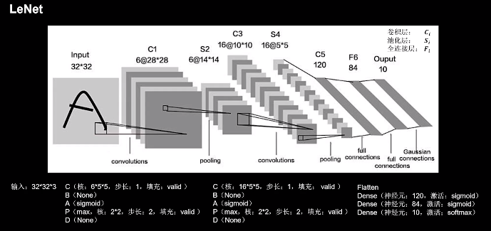

经过C1和C3两层卷积后，再经过连续的三层全链接。

- 第一层卷积：6个`5*5`的卷积核；卷积步长时1；不使用全零填充；LeNet提出时还没有BN操作，所以不使用BN操作；LeNet时代sigmoid是主流的激活函数，所以使用sigmoid激活函数；用`2*2`的池化核，步长为2，不使用全零填充；LeNet时代还没有Dropout，不使用Dropout。
- 第二层是16个`5*5`的卷积核；卷积步长为1；不使用全零填充；不使用BN操作；使用sigmoid激活函数；用`2*2`的池化核，步长为2，不使用全零填充；不使用Dropout。
- FLatten拉直，连续三层全连接网络，神经元分别是120、84、10，前两层全连接使用sigmoid激活函数，最后一层使用softmax使输出符合概率分布。


代码示例

```python
import tensorflow as tf
import os
import numpy as np
from matplotlib import pyplot as plt
from tensorflow.keras.layers import Conv2D, BatchNormalization, Activation, MaxPool2D, Dropout, Flatten, Dense
from tensorflow.keras import Model

np.set_printoptions(threshold=np.inf)

cifar10 = tf.keras.datasets.cifar10
(x_train, y_train), (x_test, y_test) = cifar10.load_data()
x_train, x_test = x_train / 255.0, x_test / 255.0


class LeNet5(Model):
    def __init__(self):
        super(LeNet5, self).__init__()
        self.c1 = Conv2D(filters=6, kernel_size=(5, 5),
                         activation='sigmoid')
        self.p1 = MaxPool2D(pool_size=(2, 2), strides=2)

        self.c2 = Conv2D(filters=16, kernel_size=(5, 5),
                         activation='sigmoid')
        self.p2 = MaxPool2D(pool_size=(2, 2), strides=2)

        self.flatten = Flatten()
        self.f1 = Dense(120, activation='sigmoid')
        self.f2 = Dense(84, activation='sigmoid')
        self.f3 = Dense(10, activation='softmax')

    def call(self, x):
        x = self.c1(x)
        x = self.p1(x)

        x = self.c2(x)
        x = self.p2(x)

        x = self.flatten(x)
        x = self.f1(x)
        x = self.f2(x)
        y = self.f3(x)
        return y


model = LeNet5()

model.compile(optimizer='adam',
              loss=tf.keras.losses.SparseCategoricalCrossentropy(from_logits=False),
              metrics=['sparse_categorical_accuracy'])

checkpoint_save_path = "./checkpoint/LeNet5.ckpt"
if os.path.exists(checkpoint_save_path + '.index'):
    print('-------------load the model-----------------')
    model.load_weights(checkpoint_save_path)

cp_callback = tf.keras.callbacks.ModelCheckpoint(filepath=checkpoint_save_path,
                                                 save_weights_only=True,
                                                 save_best_only=True)

history = model.fit(x_train, y_train, batch_size=32, epochs=5, validation_data=(x_test, y_test), validation_freq=1,
                    callbacks=[cp_callback])
model.summary()

# print(model.trainable_variables)
file = open('./weights/weights_LeNet5.txt', 'w')
for v in model.trainable_variables:
    file.write(str(v.name) + '\n')
    file.write(str(v.shape) + '\n')
    file.write(str(v.numpy()) + '\n')
file.close()

###############################################    show   ###############################################

# 显示训练集和验证集的acc和loss曲线
acc = history.history['sparse_categorical_accuracy']
val_acc = history.history['val_sparse_categorical_accuracy']
loss = history.history['loss']
val_loss = history.history['val_loss']

plt.subplot(1, 2, 1)
plt.plot(acc, label='Training Accuracy')
plt.plot(val_acc, label='Validation Accuracy')
plt.title('Training and Validation Accuracy')
plt.legend()

plt.subplot(1, 2, 2)
plt.plot(loss, label='Training Loss')
plt.plot(val_loss, label='Validation Loss')
plt.title('Training and Validation Loss')
plt.legend()
plt.show()
```

### AlexNet

​		AlexNet网络诞生于2012年，是Hinton的代表作之一，当年ImageNet竞赛的冠军，Top5错 误率为16.4%。

​		AlexNet使用relu激活函数，提升了训练速度，使用Dropout缓解了过拟合，AlexNet共有8层

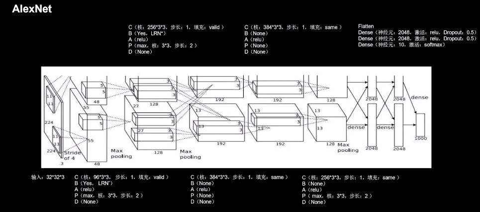

- 第一层使用了96个`3*3`卷积核；步长为1；不使用全零填充；原论文中使用局部响应标准化LRN，由于LRN操作近些年用得很少，它的功能与批标准化BN相似，所以选择当前主流的BN操作实现特征标准化；使用relu激活函数；用3*3的池化核步长是2做最大池化；不使用Dropout；
- 第二层使用了256个`3*3`卷积核；步长为1；不使用全零填充；选择BN操作实现特征标准化；使用relu激活函数；用3*3的池化核步长是2做最大池化；不使用Dropout；
- 第三层使用了384个`3*3`卷积核；步长为1；使用全零填充；不使用BN操作实现特征标准化；使用relu激活函数；不使用池化；不使用Dropout；
- 第四层使用了384个`3*3`卷积核；步长为1；使用全零填充；不使用BN操作实现特征标准化；使用relu激活函数；不使用池化；不使用Dropout；
- 第五层使用了256个`3*3`卷积核；步长为1；使用全零填充；不使用BN操作；使用relu激活函数；用3*3的池化核步长是2做最大池化；不使用Dropout；
- 第六七八层是全连接层，六七层使用2048个神经元，relu激活函数50%Dropout；第八层使用10个神经元，用softmax使输出符合概率分布

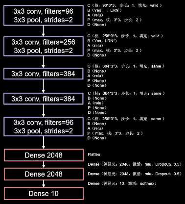

代码示例

```python
import tensorflow as tf
import os
import numpy as np
from matplotlib import pyplot as plt
from tensorflow.keras.layers import Conv2D, BatchNormalization, Activation, MaxPool2D, Dropout, Flatten, Dense
from tensorflow.keras import Model

np.set_printoptions(threshold=np.inf)

cifar10 = tf.keras.datasets.cifar10
(x_train, y_train), (x_test, y_test) = cifar10.load_data()
x_train, x_test = x_train / 255.0, x_test / 255.0


class AlexNet8(Model):
    def __init__(self):
        super(AlexNet8, self).__init__()
        self.c1 = Conv2D(filters=96, kernel_size=(3, 3))
        self.b1 = BatchNormalization()
        self.a1 = Activation('relu')
        self.p1 = MaxPool2D(pool_size=(3, 3), strides=2)

        self.c2 = Conv2D(filters=256, kernel_size=(3, 3))
        self.b2 = BatchNormalization()
        self.a2 = Activation('relu')
        self.p2 = MaxPool2D(pool_size=(3, 3), strides=2)

        self.c3 = Conv2D(filters=384, kernel_size=(3, 3), padding='same',
                         activation='relu')
                         
        self.c4 = Conv2D(filters=384, kernel_size=(3, 3), padding='same',
                         activation='relu')
                         
        self.c5 = Conv2D(filters=256, kernel_size=(3, 3), padding='same',
                         activation='relu')
        self.p3 = MaxPool2D(pool_size=(3, 3), strides=2)

        self.flatten = Flatten()
        self.f1 = Dense(2048, activation='relu')
        self.d1 = Dropout(0.5)
        self.f2 = Dense(2048, activation='relu')
        self.d2 = Dropout(0.5)
        self.f3 = Dense(10, activation='softmax')

    def call(self, x):
        x = self.c1(x)
        x = self.b1(x)
        x = self.a1(x)
        x = self.p1(x)

        x = self.c2(x)
        x = self.b2(x)
        x = self.a2(x)
        x = self.p2(x)

        x = self.c3(x)

        x = self.c4(x)

        x = self.c5(x)
        x = self.p3(x)

        x = self.flatten(x)
        x = self.f1(x)
        x = self.d1(x)
        x = self.f2(x)
        x = self.d2(x)
        y = self.f3(x)
        return y


model = AlexNet8()

model.compile(optimizer='adam',
              loss=tf.keras.losses.SparseCategoricalCrossentropy(from_logits=False),
              metrics=['sparse_categorical_accuracy'])

checkpoint_save_path = "./checkpoint/AlexNet8.ckpt"
if os.path.exists(checkpoint_save_path + '.index'):
    print('-------------load the model-----------------')
    model.load_weights(checkpoint_save_path)

cp_callback = tf.keras.callbacks.ModelCheckpoint(filepath=checkpoint_save_path,
                                                 save_weights_only=True,
                                                 save_best_only=True)

history = model.fit(x_train, y_train, batch_size=32, epochs=5, validation_data=(x_test, y_test), validation_freq=1,
                    callbacks=[cp_callback])
model.summary()

# print(model.trainable_variables)
file = open('./weights/weights_AlexNet8.txt', 'w')
for v in model.trainable_variables:
    file.write(str(v.name) + '\n')
    file.write(str(v.shape) + '\n')
    file.write(str(v.numpy()) + '\n')
file.close()

###############################################    show   ###############################################

# 显示训练集和验证集的acc和loss曲线
acc = history.history['sparse_categorical_accuracy']
val_acc = history.history['val_sparse_categorical_accuracy']
loss = history.history['loss']
val_loss = history.history['val_loss']

plt.subplot(1, 2, 1)
plt.plot(acc, label='Training Accuracy')
plt.plot(val_acc, label='Validation Accuracy')
plt.title('Training and Validation Accuracy')
plt.legend()

plt.subplot(1, 2, 2)
plt.plot(loss, label='Training Loss')
plt.plot(val_loss, label='Validation Loss')
plt.title('Training and Validation Loss')
plt.legend()
plt.show()
```

### VGGNet

​		VGGNet诞生于2014年，当年ImageNet竞 赛的亚军，Top5错 误率减小到7.3%。

​		VGGNet使用小尺寸卷积核，在减少参数的同时提高了识别准确率，VGGNetl的网络结构规整，非常适合硬件加速

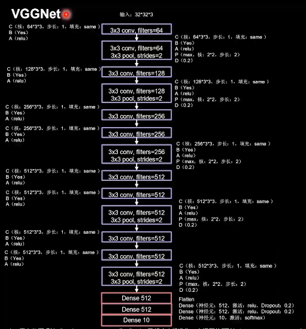

​		设计这个网络时，卷积核的个数从64到128到256到512，逐渐增加，因为越靠后，特征图尺寸越小。通过增加卷积核的个数，增加了特征图深度，保持了信息的承载能力。

代码示例

```python
import tensorflow as tf
import os
import numpy as np
from matplotlib import pyplot as plt
from tensorflow.keras.layers import Conv2D, BatchNormalization, Activation, MaxPool2D, Dropout, Flatten, Dense
from tensorflow.keras import Model

np.set_printoptions(threshold=np.inf)

cifar10 = tf.keras.datasets.cifar10
(x_train, y_train), (x_test, y_test) = cifar10.load_data()
x_train, x_test = x_train / 255.0, x_test / 255.0


class VGG16(Model):
    def __init__(self):
        super(VGG16, self).__init__()
        self.c1 = Conv2D(filters=64, kernel_size=(3, 3), padding='same')  # 卷积层1
        self.b1 = BatchNormalization()  # BN层1
        self.a1 = Activation('relu')  # 激活层1
        self.c2 = Conv2D(filters=64, kernel_size=(3, 3), padding='same', )
        self.b2 = BatchNormalization()  # BN层1
        self.a2 = Activation('relu')  # 激活层1
        self.p1 = MaxPool2D(pool_size=(2, 2), strides=2, padding='same')
        self.d1 = Dropout(0.2)  # dropout层

        self.c3 = Conv2D(filters=128, kernel_size=(3, 3), padding='same')
        self.b3 = BatchNormalization()  # BN层1
        self.a3 = Activation('relu')  # 激活层1
        self.c4 = Conv2D(filters=128, kernel_size=(3, 3), padding='same')
        self.b4 = BatchNormalization()  # BN层1
        self.a4 = Activation('relu')  # 激活层1
        self.p2 = MaxPool2D(pool_size=(2, 2), strides=2, padding='same')
        self.d2 = Dropout(0.2)  # dropout层

        self.c5 = Conv2D(filters=256, kernel_size=(3, 3), padding='same')
        self.b5 = BatchNormalization()  # BN层1
        self.a5 = Activation('relu')  # 激活层1
        self.c6 = Conv2D(filters=256, kernel_size=(3, 3), padding='same')
        self.b6 = BatchNormalization()  # BN层1
        self.a6 = Activation('relu')  # 激活层1
        self.c7 = Conv2D(filters=256, kernel_size=(3, 3), padding='same')
        self.b7 = BatchNormalization()
        self.a7 = Activation('relu')
        self.p3 = MaxPool2D(pool_size=(2, 2), strides=2, padding='same')
        self.d3 = Dropout(0.2)

        self.c8 = Conv2D(filters=512, kernel_size=(3, 3), padding='same')
        self.b8 = BatchNormalization()  # BN层1
        self.a8 = Activation('relu')  # 激活层1
        self.c9 = Conv2D(filters=512, kernel_size=(3, 3), padding='same')
        self.b9 = BatchNormalization()  # BN层1
        self.a9 = Activation('relu')  # 激活层1
        self.c10 = Conv2D(filters=512, kernel_size=(3, 3), padding='same')
        self.b10 = BatchNormalization()
        self.a10 = Activation('relu')
        self.p4 = MaxPool2D(pool_size=(2, 2), strides=2, padding='same')
        self.d4 = Dropout(0.2)

        self.c11 = Conv2D(filters=512, kernel_size=(3, 3), padding='same')
        self.b11 = BatchNormalization()  # BN层1
        self.a11 = Activation('relu')  # 激活层1
        self.c12 = Conv2D(filters=512, kernel_size=(3, 3), padding='same')
        self.b12 = BatchNormalization()  # BN层1
        self.a12 = Activation('relu')  # 激活层1
        self.c13 = Conv2D(filters=512, kernel_size=(3, 3), padding='same')
        self.b13 = BatchNormalization()
        self.a13 = Activation('relu')
        self.p5 = MaxPool2D(pool_size=(2, 2), strides=2, padding='same')
        self.d5 = Dropout(0.2)

        self.flatten = Flatten()
        self.f1 = Dense(512, activation='relu')
        self.d6 = Dropout(0.2)
        self.f2 = Dense(512, activation='relu')
        self.d7 = Dropout(0.2)
        self.f3 = Dense(10, activation='softmax')

    def call(self, x):
        x = self.c1(x)
        x = self.b1(x)
        x = self.a1(x)
        x = self.c2(x)
        x = self.b2(x)
        x = self.a2(x)
        x = self.p1(x)
        x = self.d1(x)

        x = self.c3(x)
        x = self.b3(x)
        x = self.a3(x)
        x = self.c4(x)
        x = self.b4(x)
        x = self.a4(x)
        x = self.p2(x)
        x = self.d2(x)

        x = self.c5(x)
        x = self.b5(x)
        x = self.a5(x)
        x = self.c6(x)
        x = self.b6(x)
        x = self.a6(x)
        x = self.c7(x)
        x = self.b7(x)
        x = self.a7(x)
        x = self.p3(x)
        x = self.d3(x)

        x = self.c8(x)
        x = self.b8(x)
        x = self.a8(x)
        x = self.c9(x)
        x = self.b9(x)
        x = self.a9(x)
        x = self.c10(x)
        x = self.b10(x)
        x = self.a10(x)
        x = self.p4(x)
        x = self.d4(x)

        x = self.c11(x)
        x = self.b11(x)
        x = self.a11(x)
        x = self.c12(x)
        x = self.b12(x)
        x = self.a12(x)
        x = self.c13(x)
        x = self.b13(x)
        x = self.a13(x)
        x = self.p5(x)
        x = self.d5(x)

        x = self.flatten(x)
        x = self.f1(x)
        x = self.d6(x)
        x = self.f2(x)
        x = self.d7(x)
        y = self.f3(x)
        return y


model = VGG16()

model.compile(optimizer='adam',
              loss=tf.keras.losses.SparseCategoricalCrossentropy(from_logits=False),
              metrics=['sparse_categorical_accuracy'])

checkpoint_save_path = "./checkpoint/VGG16.ckpt"
if os.path.exists(checkpoint_save_path + '.index'):
    print('-------------load the model-----------------')
    model.load_weights(checkpoint_save_path)

cp_callback = tf.keras.callbacks.ModelCheckpoint(filepath=checkpoint_save_path,
                                                 save_weights_only=True,
                                                 save_best_only=True)

history = model.fit(x_train, y_train, batch_size=32, epochs=5, validation_data=(x_test, y_test), validation_freq=1,
                    callbacks=[cp_callback])
model.summary()

# print(model.trainable_variables)
file = open('./weights/weights_VGG16.txt', 'w')
for v in model.trainable_variables:
    file.write(str(v.name) + '\n')
    file.write(str(v.shape) + '\n')
    file.write(str(v.numpy()) + '\n')
file.close()

###############################################    show   ###############################################

# 显示训练集和验证集的acc和loss曲线
acc = history.history['sparse_categorical_accuracy']
val_acc = history.history['val_sparse_categorical_accuracy']
loss = history.history['loss']
val_loss = history.history['val_loss']

plt.subplot(1, 2, 1)
plt.plot(acc, label='Training Accuracy')
plt.plot(val_acc, label='Validation Accuracy')
plt.title('Training and Validation Accuracy')
plt.legend()

plt.subplot(1, 2, 2)
plt.plot(loss, label='Training Loss')
plt.plot(val_loss, label='Validation Loss')
plt.title('Training and Validation Loss')
plt.legend()
plt.show()
```

### InceptionNet

​		InceptionNet诞生于2014年，当年ImageNet竞赛冠军，Top5错 误率为6.67%，InceptionNet引入Inception结构块，在同一层网络内使用不同尺寸的卷积核，提升了模型感知力，使用了批标准化，缓解了梯度消失。

​		InceptionNet的核心是它的基本单元Inception结构块，无论是GoogLeNet 也就是Inception v1，还是inceptionNet的后续版本，比如v2、v3、v4，都是基于Inception结构块搭建的网络。

​		Inception结构块在同层网络中便用了多个尺导的卷积核，可以提取不同尺寸的特征，通过`1*1`卷积核，作用到输入特征图的每个像素点，通过设定少于输入特征图深度的`1*1`卷积核个数，减少了输出特征图深度，起到了降维的作用，减少了参数量和计算量。


​		图中给出了一个Inception的结构块，Inception结构块包含四个分支，分别经过

- `1*1`卷积核输出到卷积连接器，
- `1*1`卷积核配合`3*3`卷积核输出到卷积连接器
- `1*1`卷积核配合`5*5`卷积核输出到卷积连接器
- `3*3`最大池化核配合`1*1`卷积核输出到卷积连接器

​        送到卷积连接器的特征数据尺导程同，卷积连接器会把收到的这四路特征数据按深度方向拼接，形成Inception结构块的输出。


​		Inception结构块用CBAPD描述出来，用颜色对应上Inception结构块内的操作。


- 第一分支卷积采用了16个`1*1`卷积核，步长为1全零填充，采用BN操作relu激活函数；
- 第二分支先用16个`1*1`卷积核降维，步长为1全零填充，采用BN操作relu激活函数；再用16个`3*3`卷积核，步长为1全零填充，采用BN操作relu激活函数；
- 第三分支先用16个`1*1`卷积核降维，步长为1全零填充，采用BN操作relu激活函数；再用16个`5*5`卷积核，步长为1全零填充，采用BN操作relu激活函数；
- 第四分支先采用最大池化，池化核尺可是`3*3`，步长为1全零填充；再用16个`1*1`卷积核降维，步长为1全零填充，采用BN操作relu激活函数；

​       卷积连接器把这四个分支按照深度方向堆叠在一起，构成Inception结构块的输出，由于Inception结构块中的卷积操作均采用了CBA结构，即先卷积再BN再采用relu激活函数，所以将其定义成一个新的类ConvBNRelu，减少代码长度，增加可读性。

```python
class ConvBNRelu(Model):
    def __init__(self, ch, kernelsz=3, strides=1, padding='same'):
        # 定义了默认卷积核边长是3步长为1全零填充
        super(ConvBNRelu, self).__init__()
        self.model = tf.keras.models.Sequential([
            Conv2D(ch, kernelsz, strides=strides, padding=padding),
            BatchNormalization(),
            Activation('relu')
        ])

    def call(self, x):
        x = self.model(x, training=False) 
        #在training=False时，BN通过整个训练集计算均值、方差去做批归一化，training=True时，通过当前batch的均值、方差去做批归一化。推理时 training=False效果好
        return x
```

​		参数 ch 代表特征图的通道数，也即卷积核个数;kernelsz 代表卷积核尺寸;strides 代表 卷积步长;padding 代表是否进行全零填充。
​		 完成了这一步后，就可以开始构建 InceptionNet 的基本单元了，同样利用 class 定义的方式，定义一个新的 InceptionBlk类。

```python
class InceptionBlk(Model):
    def __init__(self, ch, strides=1):
        super(InceptionBlk, self).__init__()
        self.ch = ch
        self.strides = strides
        self.c1 = ConvBNRelu(ch, kernelsz=1, strides=strides)
        self.c2_1 = ConvBNRelu(ch, kernelsz=1, strides=strides)
        self.c2_2 = ConvBNRelu(ch, kernelsz=3, strides=1)
        self.c3_1 = ConvBNRelu(ch, kernelsz=1, strides=strides)
        self.c3_2 = ConvBNRelu(ch, kernelsz=5, strides=1)
        self.p4_1 = MaxPool2D(3, strides=1, padding='same')
        self.c4_2 = ConvBNRelu(ch, kernelsz=1, strides=strides)

    def call(self, x):
        x1 = self.c1(x)
        x2_1 = self.c2_1(x)
        x2_2 = self.c2_2(x2_1)
        x3_1 = self.c3_1(x)
        x3_2 = self.c3_2(x3_1)
        x4_1 = self.p4_1(x)
        x4_2 = self.c4_2(x4_1)
        # concat along axis=channel
        x = tf.concat([x1, x2_2, x3_2, x4_2], axis=3)
        return x
```

​		参数 ch 仍代表通道数，strides 代表卷积步长，与 ConvBNRelu 类中一致;`tf.concat` 函数将四个输出按照深度方向连接在一起，x1、x2_2、x3_2、x4_2 分别代表四列输出，结合结构图和代码很容易看出二者的对应关系。
​		InceptionNet 网络的主体就是由其基本单元构成的，有了Inception结构块后，就可以搭建出一个精简版本的InceptionNet，网络共有10层，其模型结构如图

​		第一层采用16个3*3卷积核，步长为1，全零填充，BN操作，rule激活。随后是4个Inception结构块顺序相连，每两个Inception结构块组成俞block，每个bIock中的第一个Inception结构块，卷积步长是2，第二个Inception结构块，卷积步长是1，这使得第一个Inception结构块输出特征图尺寸减半，因此把输出特征图深度加深，尽可能保证特征抽取中信息的承载量一致。

​		block_0设置的通道数是16，经过了四个分支，输出的深度为`4*16=64`；在`self.out_channels *= 2`给通道数加倍了，所以block_1通道数是block_0通道数的两倍是32，经过了四个分支，输出的深度为`4*32=128`，这128个通道的数据会被送入平均池化，送入10个分类的全连接。


```python
class Inception10(Model):
    def __init__(self, num_blocks, num_classes, init_ch=16, **kwargs):
        super(Inception10, self).__init__(**kwargs)
        self.in_channels = init_ch
        self.out_channels = init_ch
        self.num_blocks = num_blocks
        self.init_ch = init_ch

        # 第一层采用16个3*3卷积核，步长为1，全零填充，BN操作，rule激活。
        # 设定了默认init_ch=16,默认输出深度是16，
        # 定义ConvBNRe lu类的时候，默认卷积核边长是3步长为1全零填充，所以直接调用
        self.c1 = ConvBNRelu(init_ch)

        # 每个bIock中的第一个Inception结构块，卷积步长是2，
        # 第二个Inception结构块，卷积步长是1，
        self.blocks = tf.keras.models.Sequential()
        for block_id in range(num_blocks):
            for layer_id in range(2):
                if layer_id == 0:
                    block = InceptionBlk(self.out_channels, strides=2)
                else:
                    block = InceptionBlk(self.out_channels, strides=1)
                self.blocks.add(block)
            # enlarger out_channels per block

            # 给通道数加倍了，所以block_1通道数是block_0通道数的两倍是32
            self.out_channels *= 2

        self.p1 = GlobalAveragePooling2D()  # 128个通道的数据会被送入平均池化
        self.f1 = Dense(num_classes, activation='softmax')  # 送入10个分类的全连接。

    def call(self, x):
        x = self.c1(x)
        x = self.blocks(x)
        x = self.p1(x)
        y = self.f1(x)
        return y
```

- 参数 `num_block` 代表 InceptionNet 的 Block 数，每个 Block 由两个基本单元构成；
- `num_classes` 代表分类数，对于 cifar10 数据集来说即为 10;
- `init_ch` 代表初始通道数，也即 InceptionNet 基本单元的初始卷积核个数。
  		InceptionNet 网络不再像 VGGNet 一样有三层全连接层(全连接层的参数量占 VGGNet 总参数量的 90 %)，而是采用“全局平均池化+全连接层”的方式，这减少了大量的参数。

全部代码

```python
import tensorflow as tf
import os
import numpy as np
from matplotlib import pyplot as plt
from tensorflow.keras.layers import Conv2D, BatchNormalization, Activation, MaxPool2D, Dropout, Flatten, Dense, \
    GlobalAveragePooling2D
from tensorflow.keras import Model

np.set_printoptions(threshold=np.inf)

cifar10 = tf.keras.datasets.cifar10
(x_train, y_train), (x_test, y_test) = cifar10.load_data()
x_train, x_test = x_train / 255.0, x_test / 255.0


class ConvBNRelu(Model):
    def __init__(self, ch, kernelsz=3, strides=1, padding='same'):
        # 定义了默认卷积核边长是3步长为1全零填充
        super(ConvBNRelu, self).__init__()
        self.model = tf.keras.models.Sequential([
            Conv2D(ch, kernelsz, strides=strides, padding=padding),
            BatchNormalization(),
            Activation('relu')
        ])

    def call(self, x):
        x = self.model(x, training=False) #在training=False时，BN通过整个训练集计算均值、方差去做批归一化，training=True时，通过当前batch的均值、方差去做批归一化。推理时 training=False效果好
        return x


class InceptionBlk(Model):
    def __init__(self, ch, strides=1):
        super(InceptionBlk, self).__init__()
        self.ch = ch
        self.strides = strides
        self.c1 = ConvBNRelu(ch, kernelsz=1, strides=strides)
        self.c2_1 = ConvBNRelu(ch, kernelsz=1, strides=strides)
        self.c2_2 = ConvBNRelu(ch, kernelsz=3, strides=1)
        self.c3_1 = ConvBNRelu(ch, kernelsz=1, strides=strides)
        self.c3_2 = ConvBNRelu(ch, kernelsz=5, strides=1)
        self.p4_1 = MaxPool2D(3, strides=1, padding='same')
        self.c4_2 = ConvBNRelu(ch, kernelsz=1, strides=strides)

    def call(self, x):
        x1 = self.c1(x)
        x2_1 = self.c2_1(x)
        x2_2 = self.c2_2(x2_1)
        x3_1 = self.c3_1(x)
        x3_2 = self.c3_2(x3_1)
        x4_1 = self.p4_1(x)
        x4_2 = self.c4_2(x4_1)
        # concat along axis=channel
        x = tf.concat([x1, x2_2, x3_2, x4_2], axis=3)
        return x


class Inception10(Model):
    def __init__(self, num_blocks, num_classes, init_ch=16, **kwargs):
        super(Inception10, self).__init__(**kwargs)
        self.in_channels = init_ch
        self.out_channels = init_ch
        self.num_blocks = num_blocks
        self.init_ch = init_ch

        # 第一层采用16个3*3卷积核，步长为1，全零填充，BN操作，rule激活。
        # 设定了默认init_ch=16,默认输出深度是16，
        # 定义ConvBNRe lu类的时候，默认卷积核边长是3步长为1全零填充，所以直接调用
        self.c1 = ConvBNRelu(init_ch)

        # 每个bIock中的第一个Inception结构块，卷积步长是2，
        # 第二个Inception结构块，卷积步长是1，
        self.blocks = tf.keras.models.Sequential()
        for block_id in range(num_blocks):
            for layer_id in range(2):
                if layer_id == 0:
                    block = InceptionBlk(self.out_channels, strides=2)
                else:
                    block = InceptionBlk(self.out_channels, strides=1)
                self.blocks.add(block)
            # enlarger out_channels per block

            # 给通道数加倍了，所以block_1通道数是block_0通道数的两倍是32
            self.out_channels *= 2

        self.p1 = GlobalAveragePooling2D()  # 128个通道的数据会被送入平均池化
        self.f1 = Dense(num_classes, activation='softmax')  # 送入10个分类的全连接。

    def call(self, x):
        x = self.c1(x)
        x = self.blocks(x)
        x = self.p1(x)
        y = self.f1(x)
        return y

# num_blocks指定inceptionNet的Block数是2，block_0和block_1;
# num_classes指定网络10分类
model = Inception10(num_blocks=2, num_classes=10)

model.compile(optimizer='adam',
              loss=tf.keras.losses.SparseCategoricalCrossentropy(from_logits=False),
              metrics=['sparse_categorical_accuracy'])

checkpoint_save_path = "./checkpoint/Inception10.ckpt"
if os.path.exists(checkpoint_save_path + '.index'):
    print('-------------load the model-----------------')
    model.load_weights(checkpoint_save_path)

cp_callback = tf.keras.callbacks.ModelCheckpoint(filepath=checkpoint_save_path,
                                                 save_weights_only=True,
                                                 save_best_only=True)

history = model.fit(x_train, y_train, batch_size=1024, epochs=5, validation_data=(x_test, y_test), validation_freq=1,
                    callbacks=[cp_callback])
model.summary()

# print(model.trainable_variables)
file = open('./weights/weights_Inception10.txt', 'w')
for v in model.trainable_variables:
    file.write(str(v.name) + '\n')
    file.write(str(v.shape) + '\n')
    file.write(str(v.numpy()) + '\n')
file.close()

###############################################    show   ###############################################

# 显示训练集和验证集的acc和loss曲线
acc = history.history['sparse_categorical_accuracy']
val_acc = history.history['val_sparse_categorical_accuracy']
loss = history.history['loss']
val_loss = history.history['val_loss']

plt.subplot(1, 2, 1)
plt.plot(acc, label='Training Accuracy')
plt.plot(val_acc, label='Validation Accuracy')
plt.title('Training and Validation Accuracy')
plt.legend()

plt.subplot(1, 2, 2)
plt.plot(loss, label='Training Loss')
plt.plot(val_loss, label='Validation Loss')
plt.title('Training and Validation Loss')
plt.legend()
plt.show()
```

### ResNet

ResNet诞生于2015年，当年ImageNet竞赛冠军，Top5错 误率为3.57%，ResNet提出了层间残差跳连，引入了前方信息，缓解梯度消失，使神经网络层数增加成为可能，我们纵览刚刚讲过的四个卷积网络层数，网络层数加深提高识别准确率

| 模型名称     | 网络层数 |
| ------------ | -------- |
| LetNet       | 5        |
| AlexNet      | 8        |
| VGG          | 16/19    |
| InceptionNet | 22       |

​		可见人们在探索卷积实现特征提取的道路上,通过加深网络层数，取得了越来约好的效果。

​		ResNet的作者何凯明在cifar10数据集上做了个实验，他发现56层卷积网络的错误率，要高于20层卷积网络的错误率，他认为单纯堆叠神经网络层数会使神经网络模型退化，以至于后边的特征丢失了前边特征的原本模样。

​		于是他用了一根跳连线，将前边的特征直接接到了后边，使这里的输出结果H(x)，包含了堆叠卷积的非线性输出F (x)，和跳过这两层堆叠卷积直接连接过来的恒等映射x，让他们对应元素相加，这一操作有效缓解了神经网络模型堆叠导致的退化，使得神经网络可以向着更深层级发展。


注意，ResNet块中的"+"与Inception块中的"+”是不同的

- Inception块中的“+”是沿深度方向叠加(千层蛋糕层数叠加)
- ResNet块中的“+”是特征图对应元素值相加(矩阵值相加)

ResNet块中有两种情况

一种情况用图中的实线表示，这种情况两层堆叠卷积没有改变特征图的维度，也就它们特征图的个数、高、宽和深度都相同，可以直接将F(x)与x相加。

另一种情用图中的處线表示，这种情况中这两层堆叠卷积改变了特征图的维度，需要借助1*1的卷积来调整x的维度，使W (x)与F (x)的维度一致。

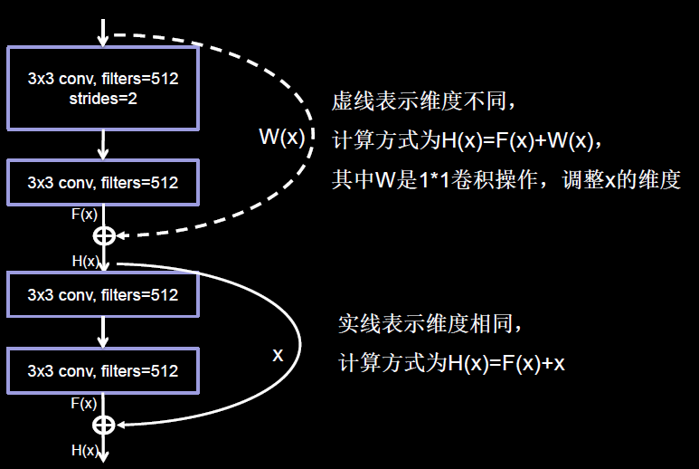

`1*1`卷积操作可通过步长改变特征图尺寸，通过卷积核个数改特征图深度。

​		ResNet块有两种形式，一种堆叠前后维度相同，另一堆叠前后维度不相同，将ResNet块的两种结构封装到一个橙色块中，定义一个ResNetBlock类，每调用一次ResNetBlock类，会生成一个黄色块。

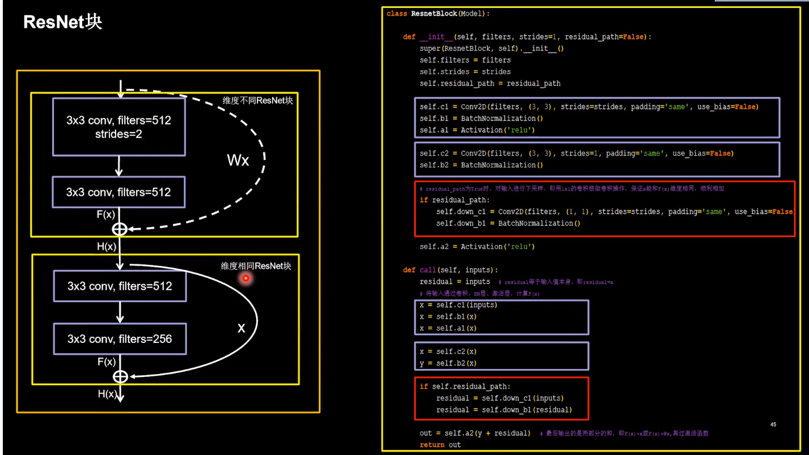

​		如果堆叠卷积层前后维度不同，residual_path等 于1,调用红色块中的代码，使用`1*1`卷积操作，调整输入特征图inputs的尺寸或深度后，将堆叠卷积输出特征y，和if语句计算歌的residual相加、过激活、输出。

​		如果堆叠卷积层前后维度相同，不执行红色块内代码，直接将堆叠卷积输出特征y和输入特征图inputs相加、过激活、输出。


搭建网络结构，ResNet18的第一层是个卷积，然后是8个ResNet块，最后是一层全连接，每一个ResNet块有两层卷积，一共是18层网络。

第一层：采用64和3*3卷积核，步长为1，全零填充，采用BN操作，rule激活，图中代码紫色块。

​		下面的结果描述四个橙色块，第一个橙色快是两条实线跳连的ResNet块，第二三四个橙色快，先虚线再实线跳连的ResNet块，用for循环实现，循环次数由参赛列表元素个数决定，这里列表赋值是2,2,2,2四个元素，最外层for循环执行四次，每次进入循环，根据当前是第几个元素，选择residual_path=True，用虚线连接，residual_path=False，用实线连接，调用ReshetBlock生成左边ResNet18结构中的一个橙色块，经过平均池化和全连接，得到输出结果

完整代码

```python
import tensorflow as tf
import os
import numpy as np
from matplotlib import pyplot as plt
from tensorflow.keras.layers import Conv2D, BatchNormalization, Activation, MaxPool2D, Dropout, Flatten, Dense
from tensorflow.keras import Model

np.set_printoptions(threshold=np.inf)

cifar10 = tf.keras.datasets.cifar10
(x_train, y_train), (x_test, y_test) = cifar10.load_data()
x_train, x_test = x_train / 255.0, x_test / 255.0


class ResnetBlock(Model):

    def __init__(self, filters, strides=1, residual_path=False):
        super(ResnetBlock, self).__init__()
        self.filters = filters
        self.strides = strides
        self.residual_path = residual_path

        self.c1 = Conv2D(filters, (3, 3), strides=strides, padding='same', use_bias=False)
        self.b1 = BatchNormalization()
        self.a1 = Activation('relu')

        self.c2 = Conv2D(filters, (3, 3), strides=1, padding='same', use_bias=False)
        self.b2 = BatchNormalization()

        # residual_path为True时，对输入进行下采样，即用1x1的卷积核做卷积操作，保证x能和F(x)维度相同，顺利相加
        if residual_path:
            self.down_c1 = Conv2D(filters, (1, 1), strides=strides, padding='same', use_bias=False)
            self.down_b1 = BatchNormalization()
        
        self.a2 = Activation('relu')

    def call(self, inputs):
        residual = inputs  # residual等于输入值本身，即residual=x
        # 将输入通过卷积、BN层、激活层，计算F(x)
        x = self.c1(inputs)
        x = self.b1(x)
        x = self.a1(x)

        x = self.c2(x)
        y = self.b2(x)

        if self.residual_path:
            residual = self.down_c1(inputs)
            residual = self.down_b1(residual)

        out = self.a2(y + residual)  # 最后输出的是两部分的和，即F(x)+x或F(x)+Wx,再过激活函数
        return out


class ResNet18(Model):

    def __init__(self, block_list, initial_filters=64):  # block_list表示每个block有几个卷积层
        super(ResNet18, self).__init__()
        self.num_blocks = len(block_list)  # 共有几个block
        self.block_list = block_list
        self.out_filters = initial_filters
        
        # 第一层
        self.c1 = Conv2D(self.out_filters, (3, 3), strides=1, padding='same', use_bias=False)
        self.b1 = BatchNormalization()
        self.a1 = Activation('relu')

        self.blocks = tf.keras.models.Sequential()
        # 构建ResNet网络结构
        for block_id in range(len(block_list)):  # 第几个resnet block
            for layer_id in range(block_list[block_id]):  # 第几个卷积层

                if block_id != 0 and layer_id == 0:  # 对除第一个block以外的每个block的输入进行下采样
                    block = ResnetBlock(self.out_filters, strides=2, residual_path=True)
                else:
                    block = ResnetBlock(self.out_filters, residual_path=False)
                self.blocks.add(block)  # 将构建好的block加入resnet
            self.out_filters *= 2  # 下一个block的卷积核数是上一个block的2倍
        self.p1 = tf.keras.layers.GlobalAveragePooling2D()
        self.f1 = tf.keras.layers.Dense(10, activation='softmax', kernel_regularizer=tf.keras.regularizers.l2())

    def call(self, inputs):
        x = self.c1(inputs)
        x = self.b1(x)
        x = self.a1(x)
        x = self.blocks(x)
        x = self.p1(x)
        y = self.f1(x)
        return y


model = ResNet18([2, 2, 2, 2])

model.compile(optimizer='adam',
              loss=tf.keras.losses.SparseCategoricalCrossentropy(from_logits=False),
              metrics=['sparse_categorical_accuracy'])

checkpoint_save_path = "./checkpoint/ResNet18.ckpt"
if os.path.exists(checkpoint_save_path + '.index'):
    print('-------------load the model-----------------')
    model.load_weights(checkpoint_save_path)

cp_callback = tf.keras.callbacks.ModelCheckpoint(filepath=checkpoint_save_path,
                                                 save_weights_only=True,
                                                 save_best_only=True)

history = model.fit(x_train, y_train, batch_size=32, epochs=5, validation_data=(x_test, y_test), validation_freq=1,
                    callbacks=[cp_callback])
model.summary()

# print(model.trainable_variables)
file = open('./weights/weights_ResNet18.txt', 'w')
for v in model.trainable_variables:
    file.write(str(v.name) + '\n')
    file.write(str(v.shape) + '\n')
    file.write(str(v.numpy()) + '\n')
file.close()

###############################################    show   ###############################################

# 显示训练集和验证集的acc和loss曲线
acc = history.history['sparse_categorical_accuracy']
val_acc = history.history['val_sparse_categorical_accuracy']
loss = history.history['loss']
val_loss = history.history['val_loss']

plt.subplot(1, 2, 1)
plt.plot(acc, label='Training Accuracy')
plt.plot(val_acc, label='Validation Accuracy')
plt.title('Training and Validation Accuracy')
plt.legend()

plt.subplot(1, 2, 2)
plt.plot(loss, label='Training Loss')
plt.plot(val_loss, label='Validation Loss')
plt.title('Training and Validation Loss')
plt.legend()
plt.show()
```

### 经典卷积网络小结

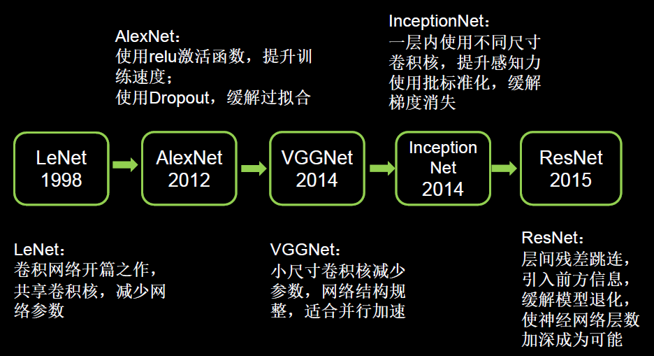

## 卷积神经网络总结

卷积是什么？卷积就是特征提取器，就是CBAPD

卷积神经网络：借助卷积核提取空间特征后，送入全连接网络


这种特征提取是借助卷积核实现的参数空间共享，通过卷积计算层提取空间信息。例如，我们可以用卷积核提取一张图片的空间特征，再把提取到的空间特征送入全连接网络，实现离散数据的分类

```python

```
