---
jupyter:
  jupytext:
    text_representation:
      extension: .md
      format_name: markdown
      format_version: '1.2'
      jupytext_version: 1.6.0
  kernelspec:
    display_name: Python 3
    language: python
    name: python3
---

# 六、循环神经网络


本讲将使用循环神经网络实现连续数据的预测


## 循环核

循环核：参数时间共享，循环层提取时间信息。

循环核具有记忆力，通过不同时刻的参数共享，实现了对时间序列的信息提取。

循环核示意：有圆柱体是记忆体，记忆体下面、侧面、上面分别有三组待训练的参数矩阵。

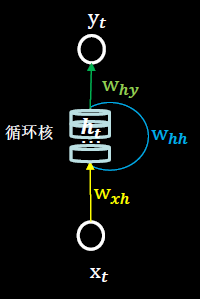

​		中间圆柱体是记忆体，可以设定个数，改变记忆容量，当记忆体个数被指定，输入xt、输出yt维度被指定，周围这些待训练参数的维度也就被限定了。

​		记忆体内存储着每个时刻的状态信息ht，记忆体当前时刻存储的状态信息ht等于，当前时刻的输入特征xt乘以矩阵wxh，加上记忆体上一时刻存储的状态信息ht-1乘以矩阵whh，再加上偏置项bh，他们的和过tanh激活函数
$$
h_{t}=\tanh \left(x_{t} w_{x h}+h_{t-1} w_{h h}+b h\right)
$$
​		当前时刻循环核的输出特征yt等于，记忆体内存储的状态信息ht乘以矩阵why，再加上偏置项by，过softmax激活函数
$$
\mathrm{y}_{t}=\operatorname{softmax}\left(h_{t} w_{h y}+b y\right)
$$
其实这就是一层全连接

前向传播时：记忆体内存储的状态信息ht，在每个时刻都被刷新，三个参数矩阵wxh、whh、why自始至终都是固定不变的。

反向传播时:三个参数矩阵wxh、whh、why被梯度下降法更新。


## 循环核按时间步展开

按照时间步展开就是把循环核按照时间轴方向展开，可以表示为下图所示

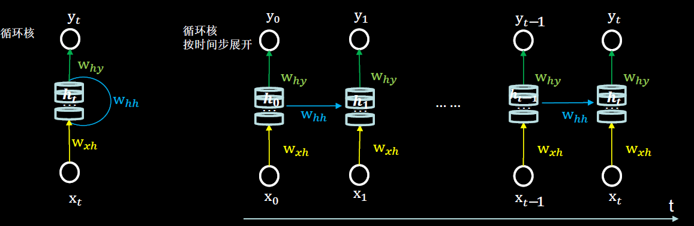

​		每个时刻记忆体状态信息ht被刷新，记忆体周围的参数矩阵wxh、whh和why是固定不变的，我们训练优化的就是这些参数矩阵，训练完成后，使用效果最好的参数矩阵，执行前向传播，输出预测结果。

​		输入几个样本才能得出结果，那就要循环几次。例如输入1，2，3，4得出5，那么就要循环核按时间展开4次。

​		其实这和我们人类的预测是一致的，你脑中的记忆体每个时刻都根据当前的输入而更新，当前的预测推理是根据你以往的知识积累，用固化下来的参数矩阵进行的推理判断。

循环神经网络：借助循环核提取时间特征后，送入全连接网络，实现连续数据的预测。

​		yt是整个循环网络的末层，从公式来看，就是一个全连接网络，借助全连接网络实现连续数据预测。


## 循环核计算层

​		每个循环核构成一层循环计算层，循环计算层的层数是向输出方向增长的

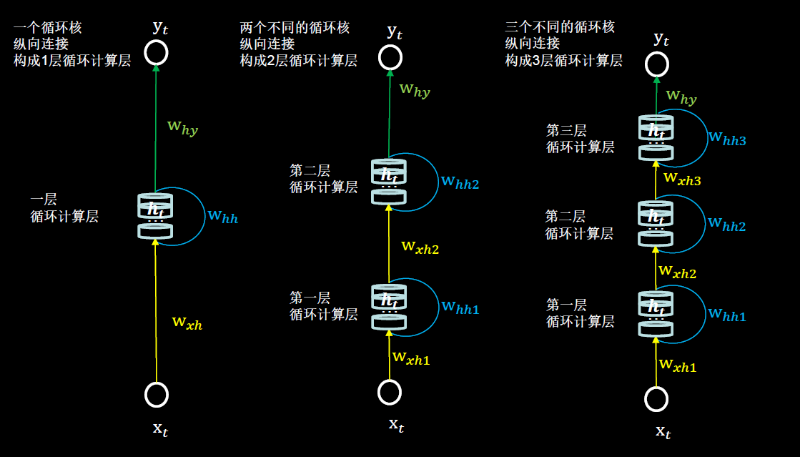

他们中的每个循环核中记忆体的个数是根据你的需求任意指定的

<!-- #region -->
## TF描述循环计算层

Tensorf low提供了计算循环层的函数
``` python
tf.keras.layers.SimpleRNN(记忆体个数，activation='激活函数’,
return_sequences= 是否每个时刻输出ht到下一层)
```
- `activation='激活函数’` (不写， 默认使用tanh)
- `return_sequences=True`  各时间步输出ht
- `return_sequences=False` 仅最后时间步输出ht (默认)。
- 一般最后一层的循环核用False，仅在最后一个时间步输出ht；中间的层循环核用True，每个时间步都把ht输出给下一层。

例如，定义了一个具有三个记忆体的循环核，这个循环核会在每个时间步输出ht

```
SimpleRNN(3, return_sequences= True)
```

`return_sequences = True`循环核各时刻会把ht推送到到下一层。循环核在每个时间步输出ht可以用这张图表示

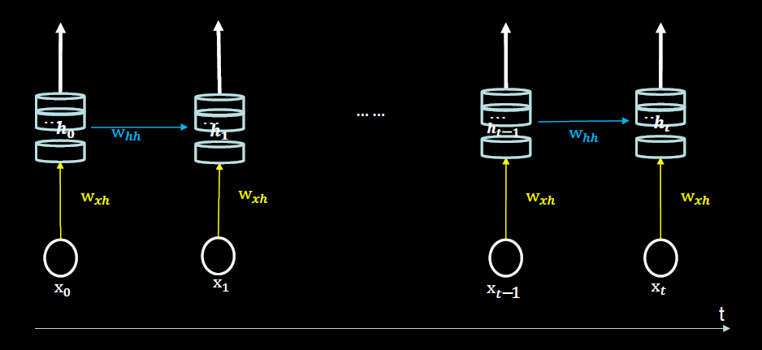

return_sequences= False循环核仅在最后一个时刻把ht推送到到下一层，中间的时间步循环核没有输出ht。

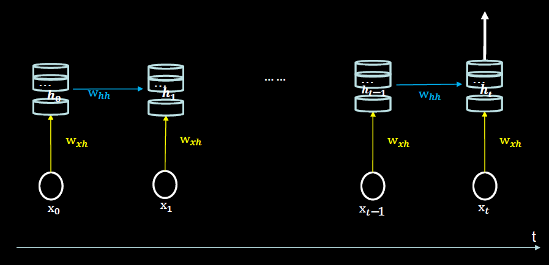

❗注意：API对送入循环层的数据维度是有要求的，要求送入循环层的数据是三维的，第一维是送入样本的总数量，第二维是循环核按时间展开的步数，第三维是每个时间步输入特征的个数。

送入RNN时，
x_train维度：[送入样本数，循环核时间展开步数，每个时间步输入特征个数]

例如：一共要送入RNN层两组数据，每组数据经过一个时间步就会得到输出结果，每个时间步送入三个数值，输入循环层的数据维度就是[2, 1, 3]。

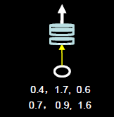

例如：只有一组数据，分四个时间步送入循环层，每个时间步送入两个数值，输入循环层的数据维度就是[1,4,2]

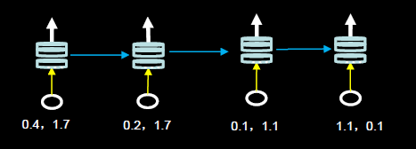

<!-- #endregion -->

## 循环网络计算过程

字母预测:输入a预测出b,输入b预测出C，输入c预测出d,输入d预测出e,输入e预测出a。

神经网络的输入都是数字，所以我们先要把用到的a、b、c、d、e这五个字母，用数字表示。最简单直接的方法就是用独热码对这五个字母编码。

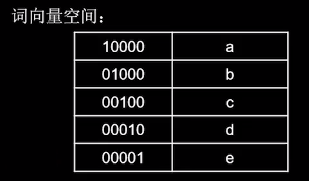

随机生成了Wxh、Whh和Why三个参数矩阵，记忆体的个数为3，初始状态ht为[0.0 0.0 0.0]

当前输入xt[0,1,0,0,0]乘以黄色的参数矩阵wxh，得到[-2.3 0.8 1.1],上一时刻也就是最开始时,记忆体状态信息等于0，所以加上0，再加上偏置矩阵bh是[0.5 0.3 -0. 2]，求和之后是[-1.8 1.1 0. 9]

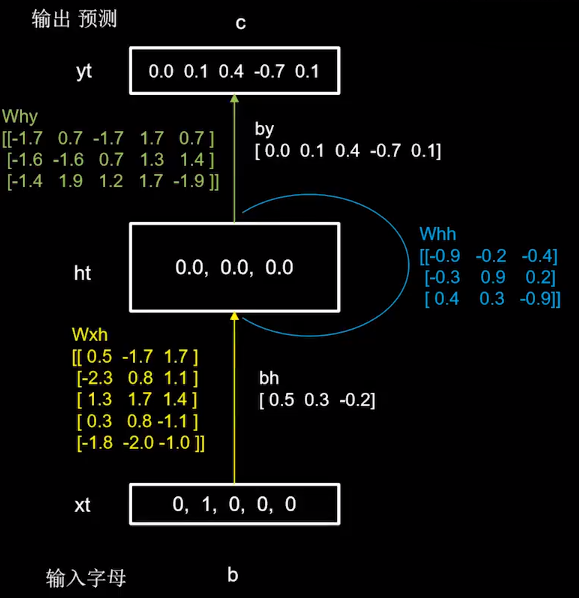
$$
\begin{aligned}
\mathrm{h}_{t} &=\tanh \left(x_{t} w_{x h}+h_{t-1} \mathrm{w}_{h h}+\mathrm{bh}\right) \\
&=\tanh ([-2.3 \quad 0.8 \quad 1.1]+0+[0.5\quad 0.3 \quad-0.2]) \\
&=\tanh [-1.8 \quad 1.1 \quad 0.9]
\end{aligned}
$$
​		过tanh激活函数后，得到当前时刻的状态信息ht，记忆体存储的状态信息被刷新为[-0.9 0.8 0.7]，这个过程可以理解为，脑中的记忆因为当前输入的事物而更新了。

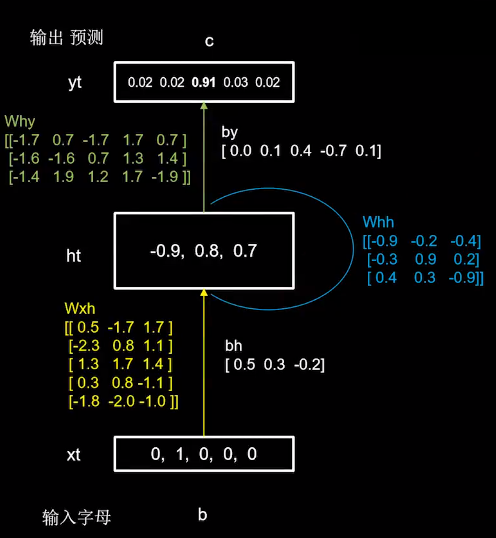
$$
\begin{aligned}
\mathrm{h}_{t} &=\tanh \left(x_{t} w_{x h}+h_{t-1} \mathrm{w}_{h h}+\mathrm{bh}\right) \\
&=\tanh ([-2.3 \quad 0.8 \quad 1.1]+0+[0.5\quad0.3\quad-0.2]) \\
&=\tanh [-1.8 \quad 1.1 \quad 0.9]=[-0.9 \quad 0.8 \quad 0.7]
\end{aligned}
$$
​		输出yt是把提取到的时间信息，通过全连接进行识别预测的过程，是整个网络的输出层，ht是当前记忆体内的数值[-0.9 0. 8 0. 7]，乘以这个绿色的参数矩阵why，加上偏置矩阵by，得到[-0.7 -0.5 3.3 0.0 -0.7]，过softmax函数得到[0.02 0.02 0.91 0.03 0. 02]，可见模型认为有91%的可能性输出字母c，所以循环网络输出了预测结果c。
$$
\begin{aligned}
\mathrm{y}_{t}=& \operatorname{softmax}\left(h_{t} w_{h y}+b y\right) \\
=& \operatorname{softmax}([-0.7\quad-0.6\quad2.9\quad0.7\quad-0.8]+[0.0 \quad 0.1 \quad 0.4 \quad-0.7\quad0.1]) \\
&=\operatorname{softmax}([-0.7 \quad- 0.5 \quad 3.3 \quad0.0\quad-0.7]) \\
&=[0.02 \quad 0.02 \quad 0.91 \quad 0.03 \quad 0.02]
\end{aligned}
$$
代码示例:

```python
import numpy as np
import tensorflow as tf
from tensorflow.keras.layers import Dense, SimpleRNN
import matplotlib.pyplot as plt
import os

input_word = "abcde"
w_to_id = {'a': 0, 'b': 1, 'c': 2, 'd': 3, 'e': 4}  # 单词映射到数值id的词典
id_to_onehot = {0: [1., 0., 0., 0., 0.], 1: [0., 1., 0., 0., 0.], 2: [0., 0., 1., 0., 0.], 3: [0., 0., 0., 1., 0.],
                4: [0., 0., 0., 0., 1.]}  # id编码为one-hot

x_train = [id_to_onehot[w_to_id['a']], id_to_onehot[w_to_id['b']], id_to_onehot[w_to_id['c']],
           id_to_onehot[w_to_id['d']], id_to_onehot[w_to_id['e']]]
y_train = [w_to_id['b'], w_to_id['c'], w_to_id['d'], w_to_id['e'], w_to_id['a']]

np.random.seed(7)
np.random.shuffle(x_train)
np.random.seed(7)
np.random.shuffle(y_train)
tf.random.set_seed(7)

# 使x_train符合SimpleRNN输入要求：[送入样本数， 循环核时间展开步数， 每个时间步输入特征个数]。
# 此处整个数据集送入，送入样本数为len(x_train)；输入1个字母出结果，循环核时间展开步数为1; 表示为独热码有5个输入特征，每个时间步输入特征个数为5
x_train = np.reshape(x_train, (len(x_train), 1, 5))
y_train = np.array(y_train)

model = tf.keras.Sequential([
    SimpleRNN(3),  # 搭建具有三个记忆体的循环层，3是任意取的数字，超参数
    Dense(5, activation='softmax')  # Dense层就是一层全连接，它实现了输出层yt的计算
])

model.compile(optimizer=tf.keras.optimizers.Adam(0.01),
              loss=tf.keras.losses.SparseCategoricalCrossentropy(from_logits=False),
              metrics=['sparse_categorical_accuracy'])

checkpoint_save_path = "./checkpoint/rnn_onehot_1pre1.ckpt"

if os.path.exists(checkpoint_save_path + '.index'):
    print('-------------load the model-----------------')
    model.load_weights(checkpoint_save_path)

cp_callback = tf.keras.callbacks.ModelCheckpoint(filepath=checkpoint_save_path,
                                                 save_weights_only=True,
                                                 save_best_only=True,
                                                 monitor='loss')  
# 由于fit没有给出测试集，不计算测试集准确率，根据loss，保存最优模型

history = model.fit(x_train, y_train, batch_size=32, epochs=100, callbacks=[cp_callback])

model.summary()

# print(model.trainable_variables)
file = open('./weights/weights_rnn_onehot_1pre1.txt', 'w')  # 参数提取
for v in model.trainable_variables:
    file.write(str(v.name) + '\n')
    file.write(str(v.shape) + '\n')
    file.write(str(v.numpy()) + '\n')
file.close()

###############################################    show   ###############################################

# 显示训练集和验证集的acc和loss曲线
acc = history.history['sparse_categorical_accuracy']
loss = history.history['loss']

plt.subplot(1, 2, 1)
plt.plot(acc, label='Training Accuracy')
plt.title('Training Accuracy')
plt.legend()

plt.subplot(1, 2, 2)
plt.plot(loss, label='Training Loss')
plt.title('Training Loss')
plt.legend()
plt.show()

############### predict #############

strlist = ["a","b","c","d","e"]
for item in strlist:
    alphabet1 = item
    alphabet = [id_to_onehot[w_to_id[alphabet1]]]
    # 使alphabet符合SimpleRNN输入要求：[送入样本数， 循环核时间展开步数， 每个时间步输入特征个数]。
    # 此处验证效果送入了1个样本，送入样本数为1；输入1个字母出结果，所以循环核时间展开步数为1; 
    # 表示为独热码有5个输入特征，每个时间步输入特征个数为5
    alphabet = np.reshape(alphabet, (1, 1, 5))
    result = model.predict([alphabet])
    pred = tf.argmax(result, axis=1)
    # tf.argmax(input,axis)根据axis取值的不同返回每行或者每列最大值的索引
    pred = int(pred)
    tf.print(alphabet1 + '->' + input_word[pred])
```

## 循环计算过程Ⅱ

​		把时间核按时间步展开，连续输入多个字母预测下一个字母的例子，以连续输入四个字母预测下一个字母为例。说明循环核按时间展开后，循环计算过程。

​		仍然使用三个记忆体，初始时刻记忆体内的记忆是0，用一套训练好的参数矩阵，说明循环计算的前向传播过程，在这个过程中的每个时刻参数矩阵是固定的，记忆体会在每个时刻被更新。

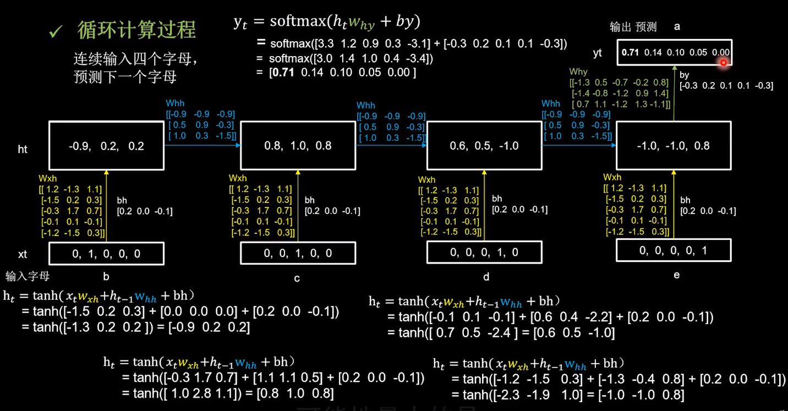

- 在第一个时刻b的独热码[0, 1,0, 0, 0]输入，记忆体根据更新公式刷新为[-0.9  0.2  0.2]
- 第二时刻c的独热码[0, 0,1,0, 0]输入，记忆体根据更新公式刷新为[0.8  1.0  0.8]
- 在第三时刻d的独热码[0, 0, 0, 1,0]输入，记忆体根据更新公式刷新为[0.6  0.5  -1.0]
- 在第四时刻e的独热码[0, 0, 0,0, 1]输入，记忆体根据更新公式刷新为[-1.0  -1.0 0.8]

​		这四个时间步中，所用到的参数矩阵wxh和偏置项bh数值是相同的，输出预测通过全连接完成，带入yt计算公式得到[0.71 0.14 0.10 0.05 0.00]，说明有71%的可能是字母a。

​		观察输出结果，模型不仅成功预测出了下一个字母是a，从神经网络输出的概率可以发现，因为输入序列的最后一个字母是e，模型认为下一个字母还是e的可能性最小，可能性最大的是a，其次分别是b, c, d。

用RNN实现输入连续四个字母，预测下一个字母(One hot编码)

- 输入abcd输出e
- 输入bcde输出a
- 输入cdea输出b
- 输入deab输出c
- 输入eabc输出d

代码示例

```python
import numpy as np
import tensorflow as tf
from tensorflow.keras.layers import Dense, SimpleRNN
import matplotlib.pyplot as plt
import os

input_word = "abcde"
w_to_id = {'a': 0, 'b': 1, 'c': 2, 'd': 3, 'e': 4}  # 单词映射到数值id的词典
id_to_onehot = {0: [1., 0., 0., 0., 0.], 1: [0., 1., 0., 0., 0.], 2: [0., 0., 1., 0., 0.], 3: [0., 0., 0., 1., 0.],
                4: [0., 0., 0., 0., 1.]}  # id编码为one-hot

x_train = [
    [id_to_onehot[w_to_id['a']], id_to_onehot[w_to_id['b']], id_to_onehot[w_to_id['c']], id_to_onehot[w_to_id['d']]],
    [id_to_onehot[w_to_id['b']], id_to_onehot[w_to_id['c']], id_to_onehot[w_to_id['d']], id_to_onehot[w_to_id['e']]],
    [id_to_onehot[w_to_id['c']], id_to_onehot[w_to_id['d']], id_to_onehot[w_to_id['e']], id_to_onehot[w_to_id['a']]],
    [id_to_onehot[w_to_id['d']], id_to_onehot[w_to_id['e']], id_to_onehot[w_to_id['a']], id_to_onehot[w_to_id['b']]],
    [id_to_onehot[w_to_id['e']], id_to_onehot[w_to_id['a']], id_to_onehot[w_to_id['b']], id_to_onehot[w_to_id['c']]],
]
y_train = [w_to_id['e'], w_to_id['a'], w_to_id['b'], w_to_id['c'], w_to_id['d']]

np.random.seed(7)
np.random.shuffle(x_train)
np.random.seed(7)
np.random.shuffle(y_train)
tf.random.set_seed(7)

# 使x_train符合SimpleRNN输入要求：[送入样本数， 循环核时间展开步数， 每个时间步输入特征个数]。
# 此处整个数据集送入，送入样本数为len(x_train)；输入4个字母出结果，循环核时间展开步数为4; 表示为独热码有5个输入特征，每个时间步输入特征个数为5
x_train = np.reshape(x_train, (len(x_train), 4, 5))
y_train = np.array(y_train)

model = tf.keras.Sequential([
    SimpleRNN(3),
    Dense(5, activation='softmax')
])

model.compile(optimizer=tf.keras.optimizers.Adam(0.01),
              loss=tf.keras.losses.SparseCategoricalCrossentropy(from_logits=False),
              metrics=['sparse_categorical_accuracy'])

checkpoint_save_path = "./checkpoint/rnn_onehot_4pre1.ckpt"

if os.path.exists(checkpoint_save_path + '.index'):
    print('-------------load the model-----------------')
    model.load_weights(checkpoint_save_path)

cp_callback = tf.keras.callbacks.ModelCheckpoint(filepath=checkpoint_save_path,
                                                 save_weights_only=True,
                                                 save_best_only=True,
                                                 monitor='loss')  # 由于fit没有给出测试集，不计算测试集准确率，根据loss，保存最优模型

history = model.fit(x_train, y_train, batch_size=32, epochs=100, callbacks=[cp_callback])

model.summary()

# print(model.trainable_variables)
file = open('./weights/weights_rnn_onehot_4pre1.txt', 'w')  # 参数提取
for v in model.trainable_variables:
    file.write(str(v.name) + '\n')
    file.write(str(v.shape) + '\n')
    file.write(str(v.numpy()) + '\n')
file.close()

###############################################    show   ###############################################

# 显示训练集和验证集的acc和loss曲线
acc = history.history['sparse_categorical_accuracy']
loss = history.history['loss']

plt.subplot(1, 2, 1)
plt.plot(acc, label='Training Accuracy')
plt.title('Training Accuracy')
plt.legend()

plt.subplot(1, 2, 2)
plt.plot(loss, label='Training Loss')
plt.title('Training Loss')
plt.legend()
plt.show()

############### predict #############

strlist = ["abcd","bcde","cdea","deab","eabc"]
for item in strlist:
    alphabet1 = item
    alphabet = [id_to_onehot[w_to_id[a]] for a in alphabet1]
    # 使alphabet符合SimpleRNN输入要求：[送入样本数， 循环核时间展开步数， 每个时间步输入特征个数]。
    # 此处验证效果送入了1个样本，送入样本数为1；输入4个字母出结果，所以循环核时间展开步数为4;
    # 表示为独热码有5个输入特征，每个时间步输入特征个数为5
    alphabet = np.reshape(alphabet, (1, 4, 5))
    result = model.predict([alphabet])
    pred = tf.argmax(result, axis=1)
    pred = int(pred)
    tf.print(alphabet1 + '->' + input_word[pred])
```

<!-- #region -->
## Embedding编码

​		独热码的位宽要与词汇量一致，如果词汇量增大时，非常浪费资源。

​		因此自然语言处理中，有专门一个方向在研究单词的编码，Embedding是一种编码方法，用低维向量实现了编码，这种编码可以通过神经网络训练优化，能表达出单词间的相关性。

- 独热码:数据量大过于稀疏，映射之间是独立的，没有表现出关联性。
- Embedding:是一种单词编码方法，用低维向量实现了编码，这种编码通过神经网络训练优化，能表达出单词间的相关性。

Tensorf low中给出了Embedding实现编码的函数

``` python
tf.keras.layers.Embedding(词汇表大小，编码维度)
```
- 词汇表大小：编码一共要表示多少个单词
- 编码维度：打算用几个数字表示一个单词

例如：想表示1到100这100个自然数，词汇表大小就是100，每个自然数用三个数字表示，编码维度就是3，所以Embedding层的参数是100和3
``` python
tf.keras.layers.Embedding(100, 3 )
```
Embedding层对输入数据的维度也有要求，要求输入数据是二维的，第一-维度告知送入几个样本，第二维度告知循环核时间展开步数

[送入样本数，循环核时间展开步数]
<!-- #endregion -->

### 预测单个字母

用RNN实现输入一个字母，预测下一个字母，用Embedding编码替换独热码

代码示例

```python
import numpy as np
import tensorflow as tf
from tensorflow.keras.layers import Dense, SimpleRNN, Embedding
import matplotlib.pyplot as plt
import os

input_word = "abcde"
w_to_id = {'a': 0, 'b': 1, 'c': 2, 'd': 3, 'e': 4}  # 单词映射到数值id的词典

x_train = [w_to_id['a'], w_to_id['b'], w_to_id['c'], w_to_id['d'], w_to_id['e']]
y_train = [w_to_id['b'], w_to_id['c'], w_to_id['d'], w_to_id['e'], w_to_id['a']]

np.random.seed(7)
np.random.shuffle(x_train)
np.random.seed(7)
np.random.shuffle(y_train)
tf.random.set_seed(7)

# 使x_train符合Embedding输入要求：[送入样本数， 循环核时间展开步数] ，
# 此处整个数据集送入所以送入，送入样本数为len(x_train)；输入1个字母出结果，循环核时间展开步数为1。
x_train = np.reshape(x_train, (len(x_train), 1))
y_train = np.array(y_train)

model = tf.keras.Sequential([
    Embedding(5, 2), # 先对输入数据进行编码,
    # 这一层会生成一个五行两列的可训练参数矩阵,实现编码可训练
    SimpleRNN(3),  # 随后设定具有三个记忆体的循环层
    Dense(5, activation='softmax')  # 设定全连接Dense层实现了输出层y的全连接计算
])

model.compile(optimizer=tf.keras.optimizers.Adam(0.01),
              loss=tf.keras.losses.SparseCategoricalCrossentropy(from_logits=False),
              metrics=['sparse_categorical_accuracy'])

checkpoint_save_path = "./checkpoint/run_embedding_1pre1.ckpt"

if os.path.exists(checkpoint_save_path + '.index'):
    print('-------------load the model-----------------')
    model.load_weights(checkpoint_save_path)

cp_callback = tf.keras.callbacks.ModelCheckpoint(filepath=checkpoint_save_path,
                                                 save_weights_only=True,
                                                 save_best_only=True,
                                                 monitor='loss')  # 由于fit没有给出测试集，不计算测试集准确率，根据loss，保存最优模型

history = model.fit(x_train, y_train, batch_size=32, epochs=100, callbacks=[cp_callback])

model.summary()

# print(model.trainable_variables)
file = open('./weights/weights_run_embedding_1pre1.txt', 'w')  # 参数提取
for v in model.trainable_variables:
    file.write(str(v.name) + '\n')
    file.write(str(v.shape) + '\n')
    file.write(str(v.numpy()) + '\n')
file.close()

###############################################    show   ###############################################

# 显示训练集和验证集的acc和loss曲线
acc = history.history['sparse_categorical_accuracy']
loss = history.history['loss']

plt.subplot(1, 2, 1)
plt.plot(acc, label='Training Accuracy')
plt.title('Training Accuracy')
plt.legend()

plt.subplot(1, 2, 2)
plt.plot(loss, label='Training Loss')
plt.title('Training Loss')
plt.legend()
plt.show()

############### predict #############

strlist = ["a","b","c","d","e"]
for item in strlist:
    alphabet1 = item
    alphabet = [w_to_id[alphabet1]]
    # 使alphabet符合Embedding输入要求：[送入样本数， 循环核时间展开步数]。
    # 此处验证效果送入了1个样本，送入样本数为1；输入1个字母出结果，循环核时间展开步数为1。
    alphabet = np.reshape(alphabet, (1, 1))
    result = model.predict(alphabet)
    pred = tf.argmax(result, axis=1)
    pred = int(pred)
    tf.print(alphabet1 + '->' + input_word[pred])
```

### 多个字母预测单个字母

用RNN实现输入连续四个字母，预测下一个字母

代码示例

```python
import numpy as np
import tensorflow as tf
from tensorflow.keras.layers import Dense, SimpleRNN, Embedding
import matplotlib.pyplot as plt
import os

input_word = "abcdefghijklmnopqrstuvwxyz"
w_to_id = {'a': 0, 'b': 1, 'c': 2, 'd': 3, 'e': 4,
           'f': 5, 'g': 6, 'h': 7, 'i': 8, 'j': 9,
           'k': 10, 'l': 11, 'm': 12, 'n': 13, 'o': 14,
           'p': 15, 'q': 16, 'r': 17, 's': 18, 't': 19,
           'u': 20, 'v': 21, 'w': 22, 'x': 23, 'y': 24, 'z': 25}  # 单词映射到数值id的词典

training_set_scaled = [0, 1, 2, 3, 4, 5, 6, 7, 8, 9, 10,
                       11, 12, 13, 14, 15, 16, 17, 18, 19, 20,
                       21, 22, 23, 24, 25]

x_train = []
y_train = []

for i in range(4, 26):
    x_train.append(training_set_scaled[i - 4:i])
    y_train.append(training_set_scaled[i])

np.random.seed(7)
np.random.shuffle(x_train)
np.random.seed(7)
np.random.shuffle(y_train)
tf.random.set_seed(7)

# 使x_train符合Embedding输入要求：[送入样本数， 循环核时间展开步数] ，
# 此处整个数据集送入所以送入，送入样本数为len(x_train)；输入4个字母出结果，循环核时间展开步数为4。
x_train = np.reshape(x_train, (len(x_train), 4))
y_train = np.array(y_train)

model = tf.keras.Sequential([
    Embedding(26, 2),
    SimpleRNN(10),
    Dense(26, activation='softmax')
])

model.compile(optimizer=tf.keras.optimizers.Adam(0.01),
              loss=tf.keras.losses.SparseCategoricalCrossentropy(from_logits=False),
              metrics=['sparse_categorical_accuracy'])

checkpoint_save_path = "./checkpoint/rnn_embedding_4pre1.ckpt"

if os.path.exists(checkpoint_save_path + '.index'):
    print('-------------load the model-----------------')
    model.load_weights(checkpoint_save_path)

cp_callback = tf.keras.callbacks.ModelCheckpoint(filepath=checkpoint_save_path,
                                                 save_weights_only=True,
                                                 save_best_only=True,
                                                 monitor='loss')  # 由于fit没有给出测试集，不计算测试集准确率，根据loss，保存最优模型

history = model.fit(x_train, y_train, batch_size=32, epochs=100, callbacks=[cp_callback])

model.summary()

file = open('./weights/weights_rnn_embedding_4pre1.txt', 'w')  # 参数提取
for v in model.trainable_variables:
    file.write(str(v.name) + '\n')
    file.write(str(v.shape) + '\n')
    file.write(str(v.numpy()) + '\n')
file.close()

###############################################    show   ###############################################

# 显示训练集和验证集的acc和loss曲线
acc = history.history['sparse_categorical_accuracy']
loss = history.history['loss']

plt.subplot(1, 2, 1)
plt.plot(acc, label='Training Accuracy')
plt.title('Training Accuracy')
plt.legend()

plt.subplot(1, 2, 2)
plt.plot(loss, label='Training Loss')
plt.title('Training Loss')
plt.legend()
plt.show()

################# predict ##################

strlist = ["abcd","bcde","hjik","opqr","uvwx"]
for item in strlist:
    alphabet1 = item
    alphabet = [w_to_id[a] for a in alphabet1]
    # 使alphabet符合Embedding输入要求：[送入样本数， 时间展开步数]。
    # 此处验证效果送入了1个样本，送入样本数为1；输入4个字母出结果，循环核时间展开步数为4。
    alphabet = np.reshape(alphabet, (1, 4))
    result = model.predict([alphabet])
    pred = tf.argmax(result, axis=1)
    pred = int(pred)
    tf.print(alphabet1 + '->' + input_word[pred])
```

## RNN实现股票预测

用连续60天的开盘价，预测第61天的开盘价

```python
import numpy as np
import tensorflow as tf
from tensorflow.keras.layers import Dropout, Dense, LSTM
import matplotlib.pyplot as plt
import os
import pandas as pd
from sklearn.preprocessing import MinMaxScaler
from sklearn.metrics import mean_squared_error, mean_absolute_error
import math

maotai = pd.read_csv('./data/SH600519.csv')  # 读取股票文件

training_set = maotai.iloc[0:2426 - 300, 2:3].values  
# 前(2426-300=2126)天的开盘价作为训练集,表格从0开始计数，
# 2:3 是提取[2:3)列，前闭后开,故提取出C列开盘价
test_set = maotai.iloc[2426 - 300:, 2:3].values  # 后300天的开盘价作为测试集

# 归一化
sc = MinMaxScaler(feature_range=(0, 1))  # 定义归一化：归一化到(0，1)之间
training_set_scaled = sc.fit_transform(training_set)  # 求得训练集的最大值，最小值这些训练集固有的属性，并在训练集上进行归一化
test_set = sc.transform(test_set)  # 利用训练集的属性对测试集进行归一化

x_train = []
y_train = []

x_test = []
y_test = []

# 测试集：csv表格中前2426-300=2126天数据
# 利用for循环，遍历整个训练集，提取训练集中连续60天的开盘价作为输入特征x_train，第61天的数据作为标签，for循环共构建2426-300-60=2066组数据。
for i in range(60, len(training_set_scaled)):
    x_train.append(training_set_scaled[i - 60:i, 0])
    y_train.append(training_set_scaled[i, 0])
# 对训练集进行打乱
np.random.seed(7)
np.random.shuffle(x_train)
np.random.seed(7)
np.random.shuffle(y_train)
tf.random.set_seed(7)
# 将训练集由list格式变为array格式
x_train, y_train = np.array(x_train), np.array(y_train)

# 使x_train符合RNN输入要求：[送入样本数， 循环核时间展开步数， 每个时间步输入特征个数]。
# 此处整个数据集送入，送入样本数为x_train.shape[0]即2066组数据；输入60个开盘价，预测出第61天的开盘价，循环核时间展开步数为60; 每个时间步送入的特征是某一天的开盘价，只有1个数据，故每个时间步输入特征个数为1
x_train = np.reshape(x_train, (x_train.shape[0], 60, 1))
# 测试集：csv表格中后300天数据
# 利用for循环，遍历整个测试集，提取测试集中连续60天的开盘价作为输入特征x_train，第61天的数据作为标签，for循环共构建300-60=240组数据。
for i in range(60, len(test_set)):
    x_test.append(test_set[i - 60:i, 0])
    y_test.append(test_set[i, 0])
# 测试集变array并reshape为符合RNN输入要求：[送入样本数， 循环核时间展开步数， 每个时间步输入特征个数]
x_test, y_test = np.array(x_test), np.array(y_test)
x_test = np.reshape(x_test, (x_test.shape[0], 60, 1))

model = tf.keras.Sequential([
    LSTM(80, return_sequences=True),
    Dropout(0.2),
    LSTM(100),
    Dropout(0.2),
    Dense(1)
])

model.compile(optimizer=tf.keras.optimizers.Adam(0.001),
              loss='mean_squared_error')  # 损失函数用均方误差
# 该应用只观测loss数值，不观测准确率，所以删去metrics选项，一会在每个epoch迭代显示时只显示loss值

checkpoint_save_path = "./checkpoint/RNN_stock.ckpt"

if os.path.exists(checkpoint_save_path + '.index'):
    print('-------------load the model-----------------')
    model.load_weights(checkpoint_save_path)

cp_callback = tf.keras.callbacks.ModelCheckpoint(filepath=checkpoint_save_path,
                                                 save_weights_only=True,
                                                 save_best_only=True,
                                                 monitor='val_loss')

history = model.fit(x_train, y_train, batch_size=64, epochs=50, validation_data=(x_test, y_test), validation_freq=1,
                    callbacks=[cp_callback])

model.summary()

file = open('./weights/weights_RNN_stock.txt', 'w')  # 参数提取
for v in model.trainable_variables:
    file.write(str(v.name) + '\n')
    file.write(str(v.shape) + '\n')
    file.write(str(v.numpy()) + '\n')
file.close()

loss = history.history['loss']
val_loss = history.history['val_loss']

plt.plot(loss, label='Training Loss')
plt.plot(val_loss, label='Validation Loss')
plt.title('Training and Validation Loss')
plt.legend()
plt.show()

################## predict ######################
# 测试集输入模型进行预测
predicted_stock_price = model.predict(x_test)
# 对预测数据还原---从（0，1）反归一化到原始范围
predicted_stock_price = sc.inverse_transform(predicted_stock_price)
# 对真实数据还原---从（0，1）反归一化到原始范围
real_stock_price = sc.inverse_transform(test_set[60:])
# 画出真实数据和预测数据的对比曲线
plt.plot(real_stock_price, color='red', label='MaoTai Stock Price')
plt.plot(predicted_stock_price, color='blue', label='Predicted MaoTai Stock Price')
plt.title('MaoTai Stock Price Prediction')
plt.xlabel('Time')
plt.ylabel('MaoTai Stock Price')
plt.legend()
plt.show()

##########evaluate##############
# calculate MSE 均方误差 ---> E[(预测值-真实值)^2] (预测值减真实值求平方后求均值)
mse = mean_squared_error(predicted_stock_price, real_stock_price)
# calculate RMSE 均方根误差--->sqrt[MSE]    (对均方误差开方)
rmse = math.sqrt(mean_squared_error(predicted_stock_price, real_stock_price))
# calculate MAE 平均绝对误差----->E[|预测值-真实值|](预测值减真实值求绝对值后求均值）
mae = mean_absolute_error(predicted_stock_price, real_stock_price)
print('均方误差: %.6f' % mse)
print('均方根误差: %.6f' % rmse)
print('平均绝对误差: %.6f' % mae)
```

## LSTM实现股票预测

​		传统循环网络RNN可以通过记忆体实现短期记忆，进行连续数据的预测，但是当连续数据的序列变长时，会使展开时间步过长，在反向传播更新参数时，梯度要按照时间步连续相乘，会导致梯度消失。所以在1997年Hochreitere等人提出了长短记忆网络LSTM，通过门控单元改善了RNN长期依赖问题。

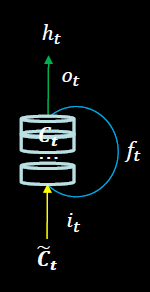

长短记忆网络中引入了三个门限，都是当前时刻的输入特征xt和上个时刻的短期记忆ht-1的函数，这三个公式中Wi、Wf和Wo是待训练参数矩阵，bi、bf和bo是待训练偏置项，都经过sigmoid激活函数，使广门限的范围在0到1之间

​		输入门（门限）
$$
i_{t}=\sigma\left(W_{i} \cdot\left[h_{t-1}, x_{t}\right]+b_{i}\right)
$$
​		遗忘门（门限）
$$
f_{t}=\sigma\left(W_{f} \cdot\left[h_{t-1}, x_{t}\right]+b_{f}\right)
$$
​		输出门（门限）
$$
o_{t}=\sigma\left(W_{o} \cdot\left[h_{t-1}, x_{t}\right]+b_{o}\right)
$$
引入了表征长期记忆的细胞态Ct，细胞态等于上个时刻的长期记忆乘以遗忘门，加上当前时刻归纳出的新知识乘以输入门

​		细胞态（长期记忆）
$$
C_{t}=f_{t} * C_{t-1}+i_{t} * \tilde{C}_{t}
$$
记忆体表示短期记忆，属于长期记忆的一部分，是细胞态过tanh激活函数乘以输出门门]的结果

​		记忆体（短期记忆）
$$
h_{t}=o_{t} * \tanh \left(C_{t}\right)
$$
引|入了等待存入长期记忆的候选态Ct波浪号，候选态表示归纳出的待存入细胞态的新知识，是当前时刻的输入特征xt，和上个时刻的短期记忆ht-1的函数，Wc是待训练参数矩阵，bc是待训练偏置项

​		候选态（归纳出新的知识）
$$
\tilde{c}_{t}=\tanh \left(W_{c \cdot}\left[h_{t-1}, \quad x_{t}\right]+b_{c}\right)
$$
理解LSTM计算过程：

​		LSTM就是听课的过程，现在脑中记住的内容是本节课第1分钟到第45分钟的长期记忆`Ct`，长期记忆`Ct`由两部分组成，

​		一部分，是本节课第1分钟到第44分钟的内容，也就是上一时刻的长期记忆`Ct-1`，因为不可能一字不差的记住所有内容，会遗忘掉一些，所以上个时刻的长期记忆`Ct-1`要乘以遗忘门`ft`，这个乘积项表示留存在脑中的对过去的记忆。

​		另一部分，现在所讲的内容是新知识，是即将存入脑中的现在的记忆，现在的记忆由两部组成，一部分是现在正在讲的第45分钟内容，还有一部分是第44分钟的短期记忆留存，这是上一时刻的短期记忆`ht-1`，脑中将当前时刻的输入`xt`和上一时刻的短期记忆`ht-1`，归纳形成即将存入你脑中的现在的记忆`Ct波浪号`，现在的记忆`Ct波浪号`乘以输入门与过去的记忆一同存储为长期记忆。

​		当我们把这节课的内容复述给朋友时，不可能一字不漏的讲出来，我们讲的是留存在脑中的长期记忆，经过输出门`ot`筛选后的内容，这就是记忆体的输出`ht`。

​		当有多层循环网络时，第二层循环网络的输入xt，就是第一层循环网络的输出ht，输入第二层网络的是第一层网络提取出的精华。

<!-- #region -->
### Tensorflow实现
``` python
tf.keras.layers.LSTM(记忆体个数，return_sequences=是否返回输出)
```
- return_ sequences=True 各时间步输出ht
- return_ sequences=False 仅最后时间步输出ht (默认)
- 一般最后一层用False，中间层用True

例子
``` python
model = tf.keras.Sequential ([
	LSTM(80, return_sequences=True),
	Dropout (0.2)，
	LSTM(100) 
	Dropout (0.2)，
	Dense (1)
])
``` 
示例
<!-- #endregion -->

```python
import numpy as np
import tensorflow as tf
from tensorflow.keras.layers import Dropout, Dense, LSTM
import matplotlib.pyplot as plt
import os
import pandas as pd
from sklearn.preprocessing import MinMaxScaler
from sklearn.metrics import mean_squared_error, mean_absolute_error
import math

maotai = pd.read_csv('./data/SH600519.csv')  # 读取股票文件

training_set = maotai.iloc[0:2426 - 300, 2:3].values  
# 前(2426-300=2126)天的开盘价作为训练集,表格从0开始计数，
# 2:3 是提取[2:3)列，前闭后开,故提取出C列开盘价
test_set = maotai.iloc[2426 - 300:, 2:3].values  # 后300天的开盘价作为测试集

# 归一化
sc = MinMaxScaler(feature_range=(0, 1))  # 定义归一化：归一化到(0，1)之间
training_set_scaled = sc.fit_transform(training_set)  # 求得训练集的最大值，最小值这些训练集固有的属性，并在训练集上进行归一化
test_set = sc.transform(test_set)  # 利用训练集的属性对测试集进行归一化

x_train = []
y_train = []

x_test = []
y_test = []

# 测试集：csv表格中前2426-300=2126天数据
# 利用for循环，遍历整个训练集，提取训练集中连续60天的开盘价作为输入特征x_train，第61天的数据作为标签，for循环共构建2426-300-60=2066组数据。
for i in range(60, len(training_set_scaled)):
    x_train.append(training_set_scaled[i - 60:i, 0])
    y_train.append(training_set_scaled[i, 0])
# 对训练集进行打乱
np.random.seed(7)
np.random.shuffle(x_train)
np.random.seed(7)
np.random.shuffle(y_train)
tf.random.set_seed(7)
# 将训练集由list格式变为array格式
x_train, y_train = np.array(x_train), np.array(y_train)

# 使x_train符合RNN输入要求：[送入样本数， 循环核时间展开步数， 每个时间步输入特征个数]。
# 此处整个数据集送入，送入样本数为x_train.shape[0]即2066组数据；输入60个开盘价，预测出第61天的开盘价，循环核时间展开步数为60; 每个时间步送入的特征是某一天的开盘价，只有1个数据，故每个时间步输入特征个数为1
x_train = np.reshape(x_train, (x_train.shape[0], 60, 1))
# 测试集：csv表格中后300天数据
# 利用for循环，遍历整个测试集，提取测试集中连续60天的开盘价作为输入特征x_train，第61天的数据作为标签，for循环共构建300-60=240组数据。
for i in range(60, len(test_set)):
    x_test.append(test_set[i - 60:i, 0])
    y_test.append(test_set[i, 0])
# 测试集变array并reshape为符合RNN输入要求：[送入样本数， 循环核时间展开步数， 每个时间步输入特征个数]
x_test, y_test = np.array(x_test), np.array(y_test)
x_test = np.reshape(x_test, (x_test.shape[0], 60, 1))

model = tf.keras.Sequential([
    LSTM(80, return_sequences=True),
    Dropout(0.2),
    LSTM(100),
    Dropout(0.2),
    Dense(1)
])

model.compile(optimizer=tf.keras.optimizers.Adam(0.001),
              loss='mean_squared_error')  # 损失函数用均方误差
# 该应用只观测loss数值，不观测准确率，所以删去metrics选项，一会在每个epoch迭代显示时只显示loss值

checkpoint_save_path = "./checkpoint/LSTM_stock.ckpt"

if os.path.exists(checkpoint_save_path + '.index'):
    print('-------------load the model-----------------')
    model.load_weights(checkpoint_save_path)

cp_callback = tf.keras.callbacks.ModelCheckpoint(filepath=checkpoint_save_path,
                                                 save_weights_only=True,
                                                 save_best_only=True,
                                                 monitor='val_loss')

history = model.fit(x_train, y_train, batch_size=64, epochs=50, validation_data=(x_test, y_test), validation_freq=1,
                    callbacks=[cp_callback])

model.summary()

file = open('./weights.txt', 'w')  # 参数提取
for v in model.trainable_variables:
    file.write(str(v.name) + '\n')
    file.write(str(v.shape) + '\n')
    file.write(str(v.numpy()) + '\n')
file.close()

loss = history.history['loss']
val_loss = history.history['val_loss']

plt.plot(loss, label='Training Loss')
plt.plot(val_loss, label='Validation Loss')
plt.title('Training and Validation Loss')
plt.legend()
plt.show()

################## predict ######################
# 测试集输入模型进行预测
predicted_stock_price = model.predict(x_test)
# 对预测数据还原---从（0，1）反归一化到原始范围
predicted_stock_price = sc.inverse_transform(predicted_stock_price)
# 对真实数据还原---从（0，1）反归一化到原始范围
real_stock_price = sc.inverse_transform(test_set[60:])
# 画出真实数据和预测数据的对比曲线
plt.plot(real_stock_price, color='red', label='MaoTai Stock Price')
plt.plot(predicted_stock_price, color='blue', label='Predicted MaoTai Stock Price')
plt.title('MaoTai Stock Price Prediction')
plt.xlabel('Time')
plt.ylabel('MaoTai Stock Price')
plt.legend()
plt.show()

##########evaluate##############
# calculate MSE 均方误差 ---> E[(预测值-真实值)^2] (预测值减真实值求平方后求均值)
mse = mean_squared_error(predicted_stock_price, real_stock_price)
# calculate RMSE 均方根误差--->sqrt[MSE]    (对均方误差开方)
rmse = math.sqrt(mean_squared_error(predicted_stock_price, real_stock_price))
# calculate MAE 平均绝对误差----->E[|预测值-真实值|](预测值减真实值求绝对值后求均值）
mae = mean_absolute_error(predicted_stock_price, real_stock_price)
print('均方误差: %.6f' % mse)
print('均方根误差: %.6f' % rmse)
print('平均绝对误差: %.6f' % mae)
```

## GRU实现股票预测

​		在2014年cho等人简化了LSTM结构，提出了GRU网络，GRU使记忆体ht融合了长期记忆和短期记忆，`ht`包含了过去信息`ht-1`和现在信息`ht波浪号`，现在信息是过去信息`ht-1`，过重置门`rt`与当前输入`xt`共同决定，两个门限的取值范围也是0到1之间。

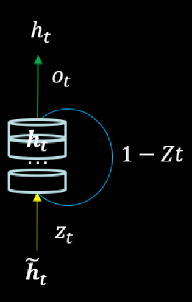

更新门
$$
z_{t}=\sigma\left(W_{z} \cdot\left[h_{t-1}, x_{t}\right]\right)
$$
重置门
$$
r_{t}=\sigma\left(W_{r} \cdot\left[h_{t-1}, x_{t}\right]\right)
$$
记忆体
$$
h_{t}=\left(1-z_{t}\right) * h_{t-1}+z_{t} * \tilde{h}_{t}
$$
候选隐藏层（当前信息）
$$
\tilde{h}_{t}=\tanh \left(W \cdot\left[r_{t} * h_{t-1}, x_{t}\right]\right)
$$
​		前向传播时，直接使用这个记忆体更新公式，就可以算出每个时刻的ht值了。


<!-- #region -->
### Tensorflow实现
``` python
tf.keras.layers.GRU(记忆体个数，return_sequences=是否返回输出)
``` 
- return_ sequences=True 各时间步输出ht
- return_ sequences=False 仅最后时间步输出ht (默认)
- 一般最后一层用False，中间层用True

例子
``` python
model = tf.keras.Sequential ([
	GRU(80, return_sequences=True),
	Dropout (0.2)，
	GRU(100) 
	Dropout (0.2)，
	Dense (1)
])
```
<!-- #endregion -->

```python
import numpy as np
import tensorflow as tf
from tensorflow.keras.layers import Dropout, Dense, GRU
import matplotlib.pyplot as plt
import os
import pandas as pd
from sklearn.preprocessing import MinMaxScaler
from sklearn.metrics import mean_squared_error, mean_absolute_error
import math

maotai = pd.read_csv('./data/SH600519.csv')  # 读取股票文件

training_set = maotai.iloc[0:2426 - 300, 2:3].values  # 前(2426-300=2126)天的开盘价作为训练集,表格从0开始计数，2:3 是提取[2:3)列，前闭后开,故提取出C列开盘价
test_set = maotai.iloc[2426 - 300:, 2:3].values  # 后300天的开盘价作为测试集

# 归一化
sc = MinMaxScaler(feature_range=(0, 1))  # 定义归一化：归一化到(0，1)之间
training_set_scaled = sc.fit_transform(training_set)  # 求得训练集的最大值，最小值这些训练集固有的属性，并在训练集上进行归一化
test_set = sc.transform(test_set)  # 利用训练集的属性对测试集进行归一化

x_train = []
y_train = []

x_test = []
y_test = []

# 测试集：csv表格中前2426-300=2126天数据
# 利用for循环，遍历整个训练集，提取训练集中连续60天的开盘价作为输入特征x_train，第61天的数据作为标签，for循环共构建2426-300-60=2066组数据。
for i in range(60, len(training_set_scaled)):
    x_train.append(training_set_scaled[i - 60:i, 0])
    y_train.append(training_set_scaled[i, 0])
# 对训练集进行打乱
np.random.seed(7)
np.random.shuffle(x_train)
np.random.seed(7)
np.random.shuffle(y_train)
tf.random.set_seed(7)
# 将训练集由list格式变为array格式
x_train, y_train = np.array(x_train), np.array(y_train)

# 使x_train符合RNN输入要求：[送入样本数， 循环核时间展开步数， 每个时间步输入特征个数]。
# 此处整个数据集送入，送入样本数为x_train.shape[0]即2066组数据；输入60个开盘价，预测出第61天的开盘价，循环核时间展开步数为60; 每个时间步送入的特征是某一天的开盘价，只有1个数据，故每个时间步输入特征个数为1
x_train = np.reshape(x_train, (x_train.shape[0], 60, 1))
# 测试集：csv表格中后300天数据
# 利用for循环，遍历整个测试集，提取测试集中连续60天的开盘价作为输入特征x_train，第61天的数据作为标签，for循环共构建300-60=240组数据。
for i in range(60, len(test_set)):
    x_test.append(test_set[i - 60:i, 0])
    y_test.append(test_set[i, 0])
# 测试集变array并reshape为符合RNN输入要求：[送入样本数， 循环核时间展开步数， 每个时间步输入特征个数]
x_test, y_test = np.array(x_test), np.array(y_test)
x_test = np.reshape(x_test, (x_test.shape[0], 60, 1))

model = tf.keras.Sequential([
    GRU(80, return_sequences=True),
    Dropout(0.2),
    GRU(100),
    Dropout(0.2),
    Dense(1)
])

model.compile(optimizer=tf.keras.optimizers.Adam(0.001),
              loss='mean_squared_error')  # 损失函数用均方误差
# 该应用只观测loss数值，不观测准确率，所以删去metrics选项，一会在每个epoch迭代显示时只显示loss值

checkpoint_save_path = "./checkpoint/GRU_stock.ckpt"

if os.path.exists(checkpoint_save_path + '.index'):
    print('-------------load the model-----------------')
    model.load_weights(checkpoint_save_path)

cp_callback = tf.keras.callbacks.ModelCheckpoint(filepath=checkpoint_save_path,
                                                 save_weights_only=True,
                                                 save_best_only=True,
                                                 monitor='val_loss')

history = model.fit(x_train, y_train, batch_size=64, epochs=50, validation_data=(x_test, y_test), validation_freq=1,
                    callbacks=[cp_callback])

model.summary()

file = open('./weights/weights_GRU_stock.txt', 'w')  # 参数提取
for v in model.trainable_variables:
    file.write(str(v.name) + '\n')
    file.write(str(v.shape) + '\n')
    file.write(str(v.numpy()) + '\n')
file.close()

loss = history.history['loss']
val_loss = history.history['val_loss']

plt.plot(loss, label='Training Loss')
plt.plot(val_loss, label='Validation Loss')
plt.title('Training and Validation Loss')
plt.legend()
plt.show()

################## predict ######################
# 测试集输入模型进行预测
predicted_stock_price = model.predict(x_test)
# 对预测数据还原---从（0，1）反归一化到原始范围
predicted_stock_price = sc.inverse_transform(predicted_stock_price)
# 对真实数据还原---从（0，1）反归一化到原始范围
real_stock_price = sc.inverse_transform(test_set[60:])
# 画出真实数据和预测数据的对比曲线
plt.plot(real_stock_price, color='red', label='MaoTai Stock Price')
plt.plot(predicted_stock_price, color='blue', label='Predicted MaoTai Stock Price')
plt.title('MaoTai Stock Price Prediction')
plt.xlabel('Time')
plt.ylabel('MaoTai Stock Price')
plt.legend()
plt.show()

##########evaluate##############
# calculate MSE 均方误差 ---> E[(预测值-真实值)^2] (预测值减真实值求平方后求均值)
mse = mean_squared_error(predicted_stock_price, real_stock_price)
# calculate RMSE 均方根误差--->sqrt[MSE]    (对均方误差开方)
rmse = math.sqrt(mean_squared_error(predicted_stock_price, real_stock_price))
# calculate MAE 平均绝对误差----->E[|预测值-真实值|](预测值减真实值求绝对值后求均值）
mae = mean_absolute_error(predicted_stock_price, real_stock_price)
print('均方误差: %.6f' % mse)
print('均方根误差: %.6f' % rmse)
print('平均绝对误差: %.6f' % mae)
```

```python

```
